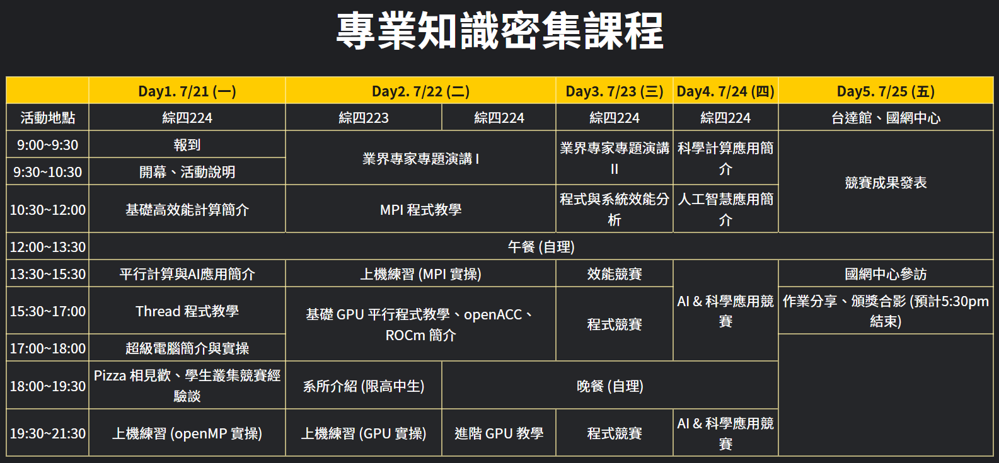

# Introduction

由於暑假不知道要幹嘛，指導教授就推薦我去 [HPCxAI Camp](https://scc.nthu.site/Summer_Camp_2025/)，這個據說是數一數二硬核的營隊，由於有教授推薦可以省下 `$2000`，當然是要推薦了。

高速計算人工智慧夏令營(HPCxAI Camp)是由清華大學叢集電腦競賽團隊和國家高速網路與計算中心(NCHC)舉辦，目前為止舉辦過 4 次，課程主要是教**平行程式設計**和**GPU 程式設計**，並且在營隊的最後兩天有效能競賽、AI 應用競賽及科學應用競賽。完整的時程表可以參考下圖：

可能會看到很多新奇/可怕的東西，但是有分組 5~6 人，並且盡可能分配到各個年齡層的組員。如果不如預期的話也可以盡情得詢問助教，他們都是叢集競賽的前幾名，也有不少經驗可以協助你完成！像是這次組內有 2 個大學生、1 個研究生、2 個高中生，不知道為啥另一個大學生特別猛，他在競賽直接解決掉 BERT，並且來協助我和研究生的地震波模擬。所以其實不用太擔心組員的素質，而且這屆高中生感覺比較有向心力，當然也不排除老六。

最後是交通的部分，由於我有申請提前住宿，並且總召建議在 `19:00` 到達小吃部(學生餐廳)，所以是搭高鐵然後接著 182 公車，下來之後會走 10 分鐘左右才會走到小吃部。

# Day 01

* 介紹這幾天的活動
* 國網機器的使用說明
* 晚上 pizza 派對
* 叢集競賽的經驗分享

# Day 02

* Nvidia 演講，主要介紹最近的技術，並且有說官網上的 DLI Cource 可以把一堂付費課程領走
* CUDA Programming，這個建議專心聽，有問題就發問，老師會回答得很清楚
* 晚上可以選擇做 CUDA Lab 或是聽 advanced CUDA，大概是教 shared memory (tiling) 和其他 memory access 優化的技巧

# Day 03

* 效能評估，使用 Intel Vtune 分析 cpu 程式執行的效能，會告訴你瓶頸在哪
* 效能競賽啟動，根據 HPL benchmark 跑到更高的 GFlops

# Day 04

* 早上快速介紹一下 AI 的知識和科學計算的東西
* 下午開始宣布競賽題目，直接炸開
* 晚上燈都亮的，大家都很努力完成競賽專題，大概忙到快 4 點才睡覺

# Day 05

搭遊覽車去國網中心，有看到超級電腦的實景（雖然只能用肉眼，不能拍），並且導覽也有說明，並且用虛擬導覽的方式展示新的 AI 超級電腦中心。最後是聽到睡著的 AI 簡報。

在分享個人競賽的時候，前幾名大部分人都是使用 AI 完成，甚至 CUDA 助教也表示自己也寫不出這麼快的。話雖如此，AI 的使用也是相當重要的課題，很久以前就已經提倡過 Prompt Enginneering 的重要性了，但其中一位參賽者也分享 Context 也是相當重要，他的工作流大概是

1. **把上課簡報轉成文字檔**
2. 把簡報文字檔及題目資料夾丟給 AI（盡量給齊全，你會以為 AI 知道，但結果會告訴你他不知道）
3. 複製貼上

至於 AI 工具的話，當下是 Gemini Pro 和 Claude Code 比較可靠。

# 心得

在團體競賽裡面拿到了**第三名**，獎品是清大的杯墊，我是不懂杯墊工藝，但花紋感覺挺精緻的。

對於平常寫循序程式的競程人，這可以讓你跳脫演算法、資料結構的框架，使用平行化、GPU 加速等等技巧來提升程式的效能。

對於已經修習過作業系統等等資工課程的大學生，可以結合編譯器優化、作業系統知識等等的概念(cache, locality)，讓程式運行的時候更有效率。
