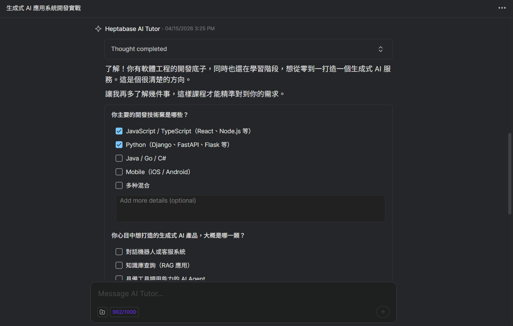
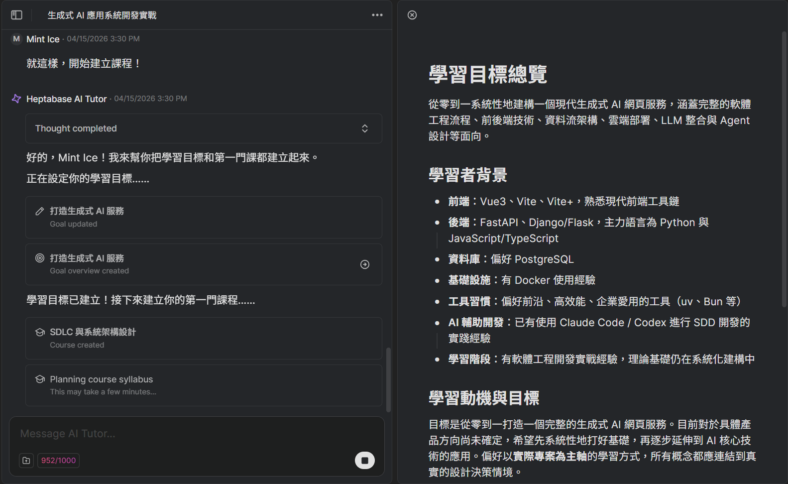
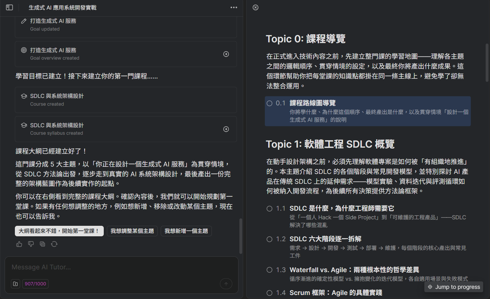
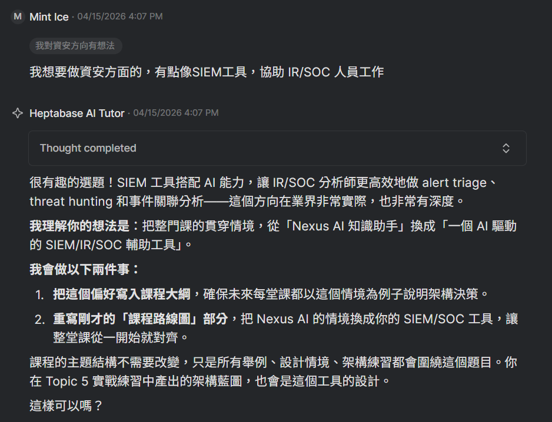
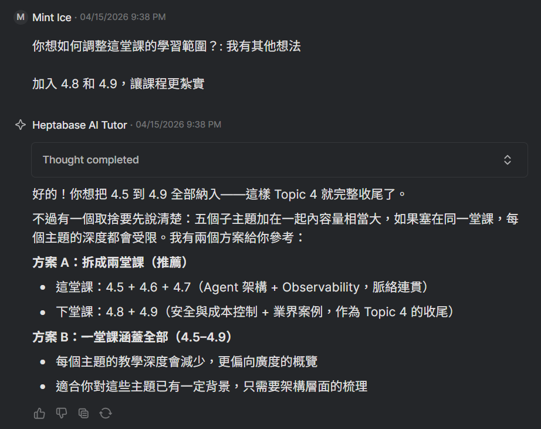
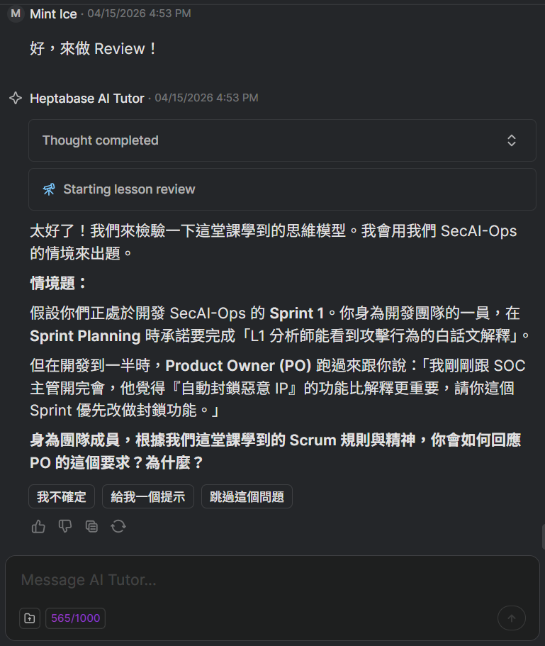
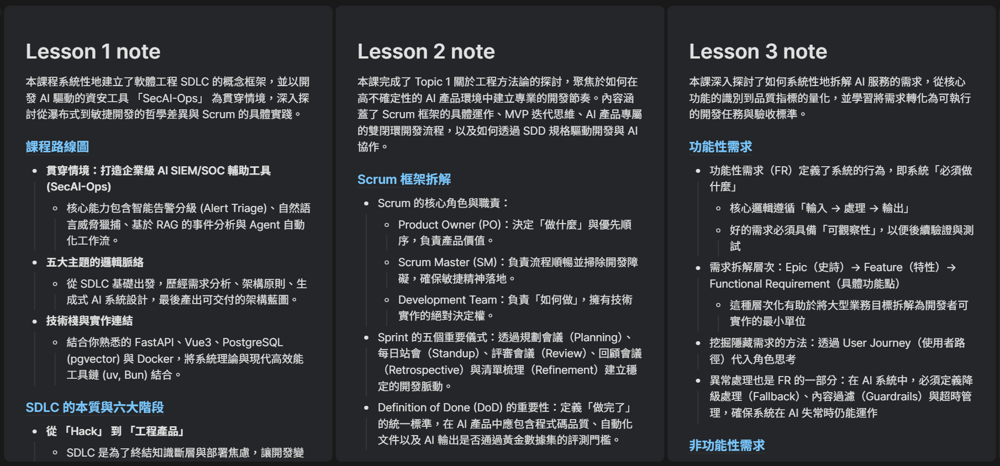

# Introduction

最近 Heptabase 推出一個 AI Tutor 的功能，付費用戶都可以使用，我是訂閱 Pro 所以有 1000 點 AI credits 可以使用。

這篇就是紀錄這學期修的[生成式 AI 應用系統與工程](https://github.com/ktchuang/TAICA_AIASE2026/tree/main)把它做成專案導向的學習方式會是怎樣，其中也包含官方的細節設計和改進反思。

## How to Start

然後他就會確認學習目標、現有程度等等，接著會安排出 5 個主題的課程大綱，如果覺得哪裡可以調整也可以提出來。當然在你開始每堂課之前也會詢問一次學習範圍，這時候也能提出調整，只是很耗 credit 就是了 QQ 最後還多付了 $4 才完成課程。

我希望會用一個專案主題當作主軸，大概是邊做邊學。一開始我沒特別選題目，所以他提了 Nexus AI 知識助手，後來我覺得不太妙所以就請他改成 SIEM/SOC 工具了，他也會調整課程路線圖。

他會根據課程規劃來產生 2~5 個小節，這邊你也可以和他討論。例如想要擴大學習範圍，那就會廣度＞深度，反之亦然。

最後在每個課程最後可以選要不要 Review，他會出 3~5 個應用題來考你，目前看來品質都是中上。當然可以選擇跳過複習，就會比較省 credit。

最後會幫你整理出課程重點筆記，會集中放在課程用的白板中，藍線的部分可以連結到原本該小節的課程教材，如果課程最後有 Review 的話也會整理到課程重點筆記中，要複習的時候真的蠻方便的！

# Afterword

目前用來學習一個主題，看起來 System Prompt (tutor) 設計得還不錯，只是內容稍微舊一點，但可以添加 source 來幫他更新資訊，例如課程教材之類的。

如果要使用 AI tutor 的話可以看官網的[說明](https://support.heptabase.com/zh-TW/articles/12990121-pro-premium-%E8%88%87-premium-%E6%96%B9%E6%A1%88%E7%9A%84%E5%AE%9A%E5%83%B9%E8%88%87%E5%B8%B8%E8%A6%8B%E5%95%8F%E7%AD%94)，目測 AI credits 消耗很快，大概每堂課要花費 80~100 credits（可以在對話框看用了多少 credits），並且在課程規劃階段吃比較多。目前根據客服端的 PJ Wu 表示，目前會以生成品質為優先考量，畢竟 AI 推論成本會慢慢降低。

總體來說還滿有趣的，可以自己思考怎麼規劃課程，然後方向偏了怎麼下 prompt 來調整課程路線，並且和原本的卡片系統也有很高的結合性，像是我就有把一些課程教材加入到原本用來做筆記的白板中，這樣就可以讓筆記更豐富，但目前是不能讓他 reference 到現有的白板的，有點可惜 QQ
