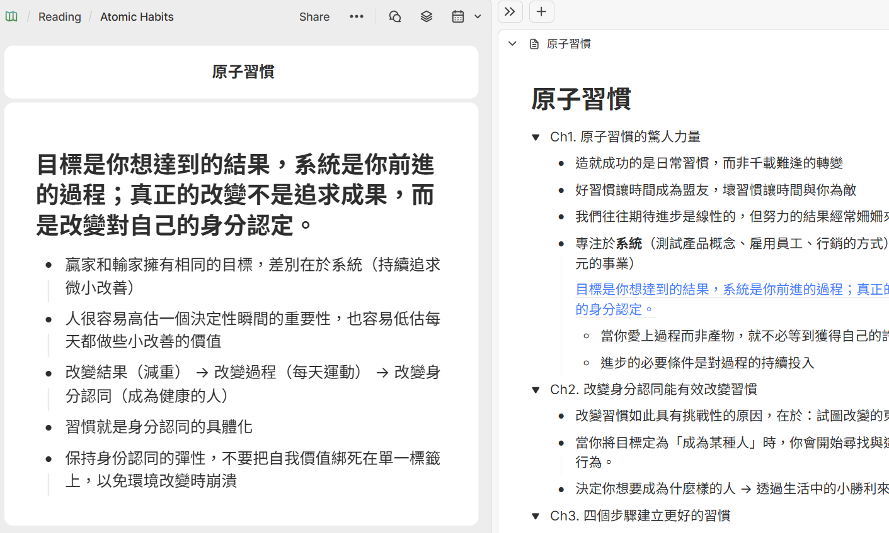
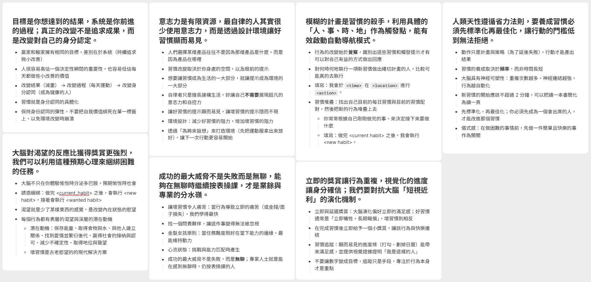
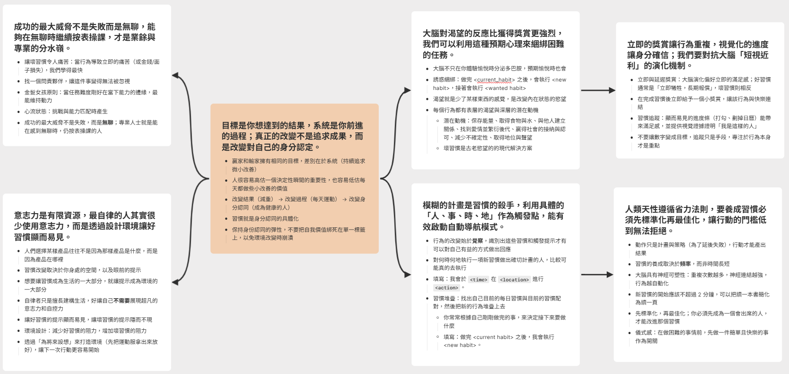

# Introduction

簡介一下 Heptabase，這個筆記軟體是由台灣人詹雨安領導開發的。不同於 Notion、Obsidian 或 HackMD 這類我們熟悉的軟體，他在**視覺化**上面下了很多功夫。它主打的**白板**功能看起來很新鮮，打破了傳統筆記軟體「由上而下」的線性邏輯，讓我們可以在無限大的畫布上自由地添加卡片、建立連結。

但說實話，剛打開 Heptabase 的時候，我經歷了一段不小的**撞牆期** :(

面對一片空白的白板，我其實沒什麼頭緒。雖然我看過官方的[教學](https://wiki.heptabase.com/organize-knowledge-and-projects?lang=zh-Hant)，裡面有很多完整的範例，但遺憾的是，這些教學真的很官方——步驟跳得很快，邏輯也相當完美，卻和我大腦原本習慣的運作模式不太一樣。我習慣的是**整理**，而 Heptabase 要求的是**思考**。為了跨過這個門檻，我決定拿最近剛讀完的經典書——[《原子習慣》]((https://www.books.com.tw/products/0010822522))來做實驗。這篇文章不是軟體教學，而是記錄我如何把原本躺在 HackMD 裡的線性筆記，透過 Heptabase 轉化為知識模型的過程。

如果你對於 Heptabase 在其他生活場景的應用有興趣，也非常推薦參考 Huli 大大的這篇[文章](https://life.huli.tw/2025/01/03/heptabase-and-life/)。他提到了「把思考過程記錄下來」的重要性，這樣未來遇到類似問題時，我們就能直接調用過去的思考結晶，這也是我想嘗試的方向。

# Methodology

我試著結合之前學過的 [Learn How to Learn](https://www.coursera.org/learn/learning-how-to-learn) 以及[第一性原理](https://medium.com/@C.W.Lin/%E9%87%8D%E6%96%B0%E7%90%86%E8%A7%A3-%E7%AC%AC%E4%B8%80%E6%80%A7%E5%8E%9F%E7%90%86-first-principles-thinking-%E4%BB%A5%E5%8F%8A%E6%88%91%E5%80%91%E6%87%89%E8%A9%B2%E6%80%8E%E9%BA%BC%E4%BD%BF%E7%94%A8-bcd7ae7bcf2a)的概念，歸納出一套適合自己的操作流程。簡單來說，我們要做的不是**搬運**筆記，而是把一座別人蓋好的城堡（書本原本的章節），拆解成一塊塊最基本的積木（第一性原理），再依照我們自己的理解重新組裝。

具體步驟如下：

1. 把原始筆記存到 Heptabase 的白板中，並創建一個(母)卡片存放原始筆記的內容
2. 原子化拆解：檢視這張卡片的內容，把核心概念相似的重點或句子提取到一張卡片中，並用一句話概括卡片內容
3. 空間重組：檢視所有提取出的卡片，把相關的概念擺得近一點，做群組化
4. 連結與結晶：把有因果關係的卡片連起來，形成思維模型

## Atomization

這是最痛苦但也最關鍵的一步。在傳統筆記中，我們習慣依照 Ch1、Ch2 的順序紀錄，但在 Heptabase 裡，我們要練習把那些**可以獨立存在的概念**拉出來變成新卡片。雖然原子習慣這本書雖然分了 20 章，但**身分認同**這個概念其實散落在幾個章節。在原子化的過程中，我必須忽略章節的順序，把這些講述同一件事的內容合併，提煉出一張名為**身分認同**的卡片，並用一句話總結它：

「目標是你想達到的結果，系統是你前進的過程；真正的改變不是追求成果，而是改變對自己的身分認定。」

這就是把知識還原成基本單元的過程。

大致拆解完後，白板上會散落著許多與章節無關，但在此刻卻異常清晰的知識點：

## Spatial Chunking & Connection

Heptabase 的白板提供了空間感，讓我能把相關的卡片擺在一起。例如，我發現**多巴胺回饋**跟**獎勵機制**其實是同一組概念，於是我把它們框成一個 Section。接著，我開始畫線。這時我才發現，原來書中提到的「身分認同」是核心，而「環境設計」、「兩分鐘法則」這些技巧，其實都是圍繞著這個核心在運轉。

- 環境設計是為了降低阻力 -> 連結到最小努力原則
- 習慣堆疊是為了創造觸發點 -> 連結到環境提示

當我把這些線連起來，並在連線上寫下自己的 Insight 時，原本的線性筆記變成了一個立體的系統。

# Conclusion

以前用 HackMD 或 Notion 時，我像個圖書館管理員，把書本的知識分門別類放好，目標是**好找**與**完整**。但這本書的知識依然屬於作者，我只是負責保管。但在 Heptabase 裡，透過拆解與重組，只留下核心的元素，然後用我自己的邏輯將其煉製成新的知識模型。這就如同 Heptabase 的 slogon「專門幫助你學習和研究複雜主題、對事物建立深度理解的視覺化筆記軟體」，現在這張白板上的東西，不再只是原子習慣的讀書筆記，而是一套**行為改變工具箱**，未來當我需要研究「如何改掉熬夜習慣」時，我不需要重讀整本書，我只需要把「環境設計」和「身分認同」這兩張卡片拿出來，就能直接應用。

這大概就是 Heptabase 帶給我最大的思維轉變：筆記的目的不是為了紀錄過去，而是為了支援未來的思考。

