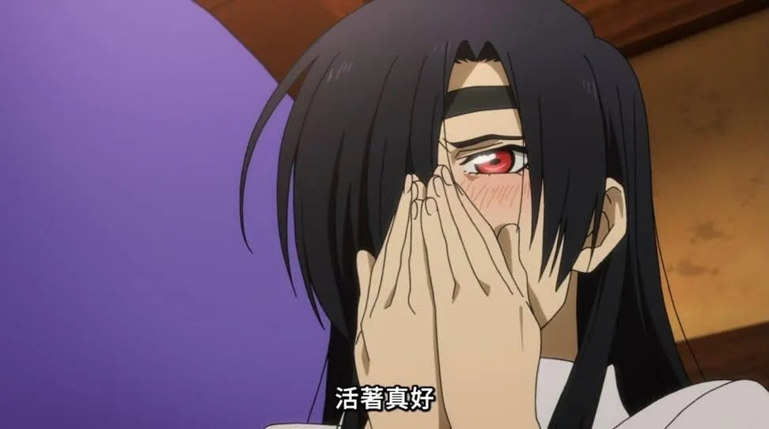

# Introduction

本來其實沒有打算去的。前面買周邊就已經花了不少錢，理智上應該要收手，但最後還是忍不住補了一張 Day2 Standing A 3xx 席。

這是我人生第一次參加演唱會。在這之前，我完全沒有任何現場演出的經驗，甚至是參戰前天才知道原來有「演唱會耳機」這種東西。結果第一次就直接挑戰全站席，現在回想起來也滿有勇氣的，最後總共站了快 3 小時。首次參戰雖然有點緊張，但整體來說附近的人還算正常，至少不會沒事亂尖叫。雖然後面還是有被煩到，拜託不要一直叫 😡。

交通方面，我是從台南搭車到板橋，再轉環狀線，最後搭接駁車去會場。從接駁車上就可以感覺到當天天氣不是很理想，充斥著熱氣。我當天穿襯衫、工裝長褲，再搭防曬外套，算是比較偏涼爽路線。結果到現場一看，大家根本帥潮美潮大集合。有很多人穿著週邊衣服，也有人自己搭得很有風格，甚至還看到一些刺客。不得不說，ずとまよ 的粉絲審美真的滿強。

因為沒有特別去排物販，所以這部分倒是沒什麼好抱怨的。到場後就領了幾個應援品，接著差不多就準備去整隊了。

> 可憐南部人要光速進場，應援只有拿一點點而已，還要迅速離場去打比賽 😭

然後就是痛苦的開始。雖然會場有很大的隊伍告示牌，但我真的不懂為什麼 VIP 和 A 的指示牌要擺成反方向：

```text
┌─────────┐   ┌────────┐
│  VIP -> │   │ <- A   │
└─────────┘   └────────┘
```

我站在那邊看了一下，腦袋直接當機。最後還是問了路人 まろ 才知道要往哪邊走。到了 A 區之後，又發現它有分幾百號到幾百號一區，但現場標示不夠清楚，導致我不知道自己到底該排在哪一段。最後還是去隊伍前方找工作人員確認才解決 🫠

進場之後，冷氣大概是「稍微有涼」的程度。我的位置大概在第 4 排，以 Standing A 來說已經算滿前面了，但站定之後還是忍不住想，果然應該買 VIP，還是想再靠近一點啊 😭。大概過了 20 分鐘左右，場內有開風扇。至少以我站的位置來說不算熱，也沒有聞到什麼奇怪的味道，附近的人感覺也都滿正常。趁著正式開始前，我稍微環視了一下四周，發現現場不只有年輕人，也有一些看起來 30、40 歲以上的觀眾，而且不一定都穿週邊。這種感覺滿好的，像是不同年齡層的人都因為同一個東西聚在這裡。

舞台上紅色的燈很亮，還沒開演就已經有一種壓迫感。舞台左邊有像樹一樣的裝置，打著紫色的光；右邊的裝置我到現在還是不太確定是什麼，但整體看起來很酷。場內也開始播放一些奇怪的背景音或音樂，像是在慢慢把觀眾拉進某個世界觀裡，螢幕右邊有大大的這個，感覺像是在倒數。那種正式開始前的等待感，真的有一點儀式感 👀。

# Concert Program

（因為規定歌單和演出細節要等 6/18 巡迴結束後才能公開，所以這邊先用代詞替換。雖然有機會找到公開的歌單，但這篇先以當下感受為主。）

# Concert Tour

一開始 MC 先介紹了一下這次巡迴的主題，也就是整體劇情和世界觀。雖然我還在理解設定，但氣氛已經被鋪起來了。接著開場居然是這首，同時 ACAね 從那個東西裡面爬出來，這畫面配上這首歌真的太強，完全不像是暖場，第一首就直接把情緒拉滿，開場這麼猛是可以的嗎 😭。

她當天穿的是羅莉塔風格的服裝，看起來就超熱，但還是可以又唱又動，甚至跳螃蟹舞和踢踏舞，真的超可愛！只是我那時候一直很怕自己沒跟到飯匙提示，所以眼睛一直在螢幕和舞台之間來回掃，反而比較少仔細看舞台細節。第一次參戰真的會有一種「我現在到底該看哪裡」的混亂感，果然最好還是第一天享受、第二天感受細節最好 QQ

後來她拿出這個的時候，現場大概很多人都瞬間懂了。那種不用明講、大家就知道接下來可能是這首的默契，讓我第一次感覺到什麼叫粉絲之間的共同語言。這種瞬間很奇妙，像是你不只在螢幕前自己聽歌，而是跟一群知道同樣暗號的人一起站在現場，幾千人都在同個頻道上。然後後面有個轉場是這個，我以為後面會接這首，不過是另一首比較少聽過的抒情歌，有點小驚喜。

舞台左右兩側的光影也很漂亮。有一段只靠地板的光往上打，整個舞台像是從下面發亮一樣，煙霧被燈光切開之後特別有層次。那時候我才真的意識到，現場演出不是單純把歌曲「唱出來」而已，舞台、燈光、煙霧、道具和人的動作全部加在一起，才是完整的作品。舞台裝飾也比我想像中精緻很多，很多地方都看得出來是為這個巡迴主題特別設計的。

雖然我有先看過 Day1 的歌單，知道 Day2 可能會有日替，但後來其中一首被換成這首，還是完全出乎意料。第一次聽到它是在萬博散場的時候，當時就很有感覺，沒想到這次居然能在演唱會現場聽到。那一刻真的有點不真實，像是某個記憶突然被接回來一樣。很感動，沒想到這次竟然會出這首 😭。

ACAね 幾乎是靠實力把一切都撐起來，甚至把一些本來可能會讓人分心的地方全部救回來。她的聲音跟串流完全不是同一個體驗。Spotify 裡的版本當然很好，但現場的衝擊感、呼吸感和爆發力差太多了。聽完現場之後，再回去聽串流版本真的會有一種「怎麼少了什麼」的感覺。

據說 Day2 的樂手們都很投入，吉他手是佐佐木貴之 [@kojiro_guitar](https://twitter.com/kojiro_guitar)，背彈兩次超帥的啦，現場看到真的會忍不住在心裡大叫。貝斯手二家本也是老熟了，整個人超穩，存在感很強。然後我還肉眼見識到扇風琴，真的好大一把，而且還會發光。以前只在影片或照片裡看過，實際看到會覺得那東西怎麼可以又荒謬又帥。

到最後幾首的時候，感覺 ACAね 真的已經唱到快累死了，但她還是一路撐到最後。最後用這首收尾真的很酷，本來以為會把大家的情緒收起來，反而比較像是把情緒拉上去，讓大家散場後靈魂還在那裡的感覺。

# Afterword

ACAね 真的很會帶氣氛，也會帶一些飯匙的動作。我原本以為飯匙應援是 100% 按照圖示操作，但實際進場後才發現事情沒有那麼簡單。大家很嗨的時候，前後揮的拍子有時候滿亂的，我也分不太出來到底是按照四分音符還是八分音符擺動，也許大家都在沉浸在氣氛中的時候，這種細節已經不再重要了。

一開始有很重的鼓聲時，大家會跟著拍飯勺，這部分還算好理解。但有些時候 ACAね 沒有帶動作，螢幕也沒有圖示，演出還在中段，旁邊還是有人一直敲。那種時候我真的不知道敲敲怪到底想怎樣 😡。總之我還不太確定 まろ 之間的共識是什麼。我自己的做法是只有在看到圖示，或是表演者有明顯暗示的時候才操作飯勺。有時候也會偷看右前方的人怎麼做，感覺他應該已經聽過好幾次演唱會，動作很自然，完全不像我這種第一次參戰的新手。

音響方面，感覺現場真的很爆。鼓聲常常會蓋過人聲，尤其站在我的位置時，低頻打過來會很明顯。不過後來看到有人說這可能跟站位關係比較大，所以也不確定是不是整場都這樣。以第一次演唱會來說，我還沒有足夠的比較基準，但至少那個衝擊感是真的很強。

整場演出真的很厲害。老闆的狀態太好了，樂手們看起來也都玩得很盡興。很多瞬間我都會突然意識到，自己真的站在現場，看著這些平常只會出現在影片、音源和社群上的人，把那些熟悉的歌變成眼前正在發生的東西。

總之真的很誇張。這場對我來說就是神場。我的第一次演唱會是 ZUTOMAYO，真的太好了。活著真好！



最讓我佩服的是，ACAね 現場根本是在用生命唱歌。到底一個那麼可愛、那麼小隻的女生，怎麼能夠連續兩個多小時高強度唱歌，還幾乎沒有走音或明顯失誤，最後有笑場很可愛，還偷吃巧克力喝水嗆到！她不只唱，還要演戲、帶氣氛、演奏、跑動、跳舞，甚至還要維持整個世界觀的沉浸感。我真的不能佩服更多了 🥺。

因為演唱會後失憶症的關係，明明當下覺得自己一定會記得所有細節，結果結束後腦袋像被清空，只剩下一堆碎片和情緒。所以最後筆記一下不能忘記的部分：

- 白ㄘ喔
- 不夠不夠不夠
- 沒錢沒錢沒錢
- 雜菜炒麵
- 巧克力對大腦很好

> 日式中文很可愛 QQ
